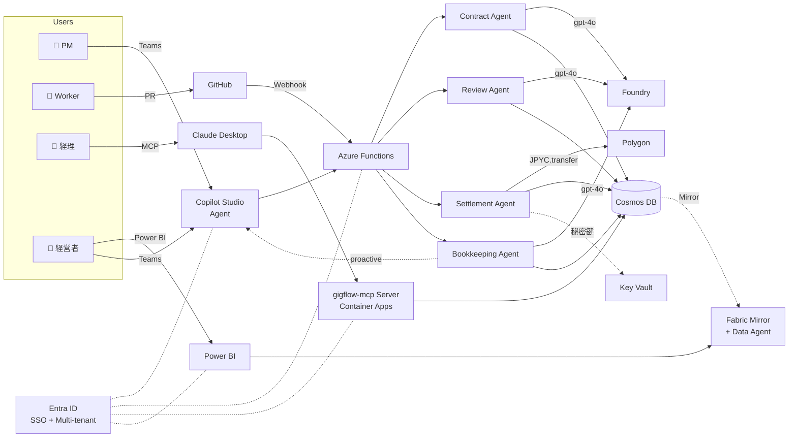

# Agentic Gig-Flow

> **副業3,000万人時代の月末経理を消す。** PRをマージした3秒後に、円建てで報酬が着金するAIエージェントシステム。

[](https://zenn.dev/hackathons)
[](LICENSE)

---

## 🎯 ビジョン

中小企業 × 海外フリーランサーの業務委託フロー: 契約 → 検収 → 報酬支払。これらは今もって「メール往復 + 月末締め月末払い + 海外送金3-5日待ち + 数千円の振込手数料」で運用されています。

**Agentic Gig-Flow** は、4つの自律エージェント + 周辺の Multi-agent エコシステムが**契約締結から JPYC での即時送金、経理処理、経営者向けレポートまで**を一貫して処理します。

- **PMは Microsoft Teams + Copilot Studio に一言**入力するだけ
- **受注者は GitHub で普段通りに PR** を出すだけ
- **経理担当者は Claude Desktop / VS Code から MCP サーバ越しに**自然言語で問い合わせ
- **経営者は Power BI と Microsoft Fabric Data Agent で**月次を把握

あとはエージェント群が完結させます。

### Before / After

| | Before | After |
|---|---|---|
| 契約・発注 | メール / 電話 | Copilot Studio に一言 (Teams) |
| 進捗管理 | Excel / Slack で個別追跡 | GitHub Issue が単一情報源 |
| 検収 | 人間の目視レビュー | Review Agent が PR を解析 |
| 報酬計算 | 月末 Excel 集計 | Settlement Agent が即時実行 |
| 振込 | 銀行サイト・3-5営業日・手数料 | JPYC 即時送金・数秒・実質ゼロ円 |
| 経理問合せ | 「月末まで待って」 | Claude Desktop から MCP 経由で即時 |
| 経営者の数字把握 | 経理に依頼 → 数日 | Teams で Fabric Data Agent に質問 → 即答 |
| 監査証跡 | 紙・PDF・分散 | Cosmos DB + オンチェーン |

### 数値インパクト (1社あたり/月、業務委託先5名想定)

- 経理工数: **20時間 → 1時間** (-95%)
- 振込手数料: **50,000円 → ほぼ0円** (-99%)
- 受注者の入金待機時間: **3-5日 → 3秒**
- 経営者の月次集計依頼: **数日 → 1分**

---

## 🏗 アーキテクチャ概観



詳細は [`docs/01-architecture.md`](docs/01-architecture.md) 参照。

---

## 🚀 クイックスタート

```bash
# 前提: Node.js 20+, pnpm 9+, Azure CLI, Azure サブスクリプション, Microsoft 365 (Copilot Studio用)
git clone <this-repo>
cd agentic-gig-flow
pnpm install

# Azure リソースの構築 (60〜90分、Entra + Fabric 含む)
cat docs/04-azure-setup.md

# Entra App Registrations
cat docs/10-entra-id.md

# Microsoft Fabric セットアップ
cat docs/11-fabric.md

# Copilot Studio Bot 構築
cat docs/08-copilot-studio.md

# MCP Server デプロイ
cat docs/09-mcp-server.md

# GitHub demo repo + webhook 設定
cat docs/05-github-setup.md

# 環境変数を設定
cp .env.example .env

# ローカル開発
pnpm --filter functions dev      # Azure Functions Core Tools
pnpm --filter dashboard dev      # Next.js Dashboard
pnpm --filter mcp-server dev     # gigflow-mcp Server
```

---

## 📁 ドキュメント

| ファイル | 内容 |
|---|---|
| [`CLAUDE.md`](CLAUDE.md) | Claude Code 用の作業指示書 (最重要) |
| [`docs/01-architecture.md`](docs/01-architecture.md) | システム構成、データフロー、Cosmos DB スキーマ |
| [`docs/02-agents.md`](docs/02-agents.md) | 4 Agent の System Prompt と Tool 定義 |
| [`docs/03-roadmap.md`](docs/03-roadmap.md) | マイルストーン依存グラフ + 受け入れ基準 |
| [`docs/04-azure-setup.md`](docs/04-azure-setup.md) | az CLI による環境構築手順 |
| [`docs/05-github-setup.md`](docs/05-github-setup.md) | GitHub demo repo + webhook 設定 |
| [`docs/06-demo-script.md`](docs/06-demo-script.md) | ピッチ動画のシーン台本 |
| [`docs/07-zenn-outline.md`](docs/07-zenn-outline.md) | Zenn 記事の章構成 |
| [`docs/08-copilot-studio.md`](docs/08-copilot-studio.md) | Copilot Studio Bot + Adaptive Card |
| [`docs/09-mcp-server.md`](docs/09-mcp-server.md) | gigflow-mcp サーバ仕様 |
| [`docs/10-entra-id.md`](docs/10-entra-id.md) | Entra ID マルチテナント設計 |
| [`docs/11-fabric.md`](docs/11-fabric.md) | Fabric Data Agent + Power BI |

---

## 🛠 技術スタック

### Microsoft (フル採用)
- **Microsoft Foundry / Azure OpenAI** — gpt-4o, function calling で 4 Agent を実装
- **Microsoft Copilot Studio** — Teams Bot として PM の発注 UI を提供 (主経路)
- **Microsoft Fabric** — Cosmos DB ミラー + Data Agent + Power BI で経営者向け BI
- **Microsoft Entra ID** — SSO + マルチテナント (companyId = tenantId)
- **Azure Functions** — HTTP / Webhook トリガーで Agent オーケストレーション
- **Azure Container Apps** — Dashboard と MCP Server をホスト
- **Azure Cosmos DB** — orders / events / accounts / tenants
- **Azure Key Vault** — ウォレット秘密鍵, GitHub PAT, Entra secrets
- **Azure Application Insights** — 構造化ログ + Multi-agent 分散トレース

### Multi-agent エコシステム
- **MCP Server (`gigflow-mcp`)** — 経理担当者の Claude Desktop / VS Code から接続
- **GitHub** — Webhook + Octokit (PR/CI イベント受信、自動 review/merge)

### Web3
- **Polygon** + **JPYC** — `viem` で `transfer()` 直叩き、即時着金
- **`viem`** — TypeScript ファーストの EVM ライブラリ

### Frontend
- **Next.js 15 (App Router)** + **Tailwind v4** + **NextAuth (Entra ID)**

### Language
- **TypeScript 5+, Node.js 20, pnpm**

---

## 🏆 ハッカソン適合 (Microsoft Agent Hackathon 2026)

仕様書要件への充足:

| 要件 | 採用プロダクト | 参照ドキュメント |
|---|---|---|
| **必須**: Azure 実行基盤 | Azure Functions + Container Apps | `docs/01-architecture.md`, `docs/04-azure-setup.md` |
| **必須**: Microsoft AI 技術 | Foundry (gpt-4o) **+** Copilot Studio (二重充足) | `docs/02-agents.md`, `docs/08-copilot-studio.md` |
| **推奨**: Cosmos DB | ✅ orders / events / accounts / tenants | `docs/01-architecture.md` §4 |
| **推奨**: GitHub | ✅ Webhook + Octokit | `docs/05-github-setup.md` |
| **推奨**: Power Platform / Fabric | ✅ Fabric Data Agent + Power BI | `docs/11-fabric.md` |
| **推奨**: Microsoft Entra ID | ✅ マルチテナント (5 App Registrations) | `docs/10-entra-id.md` |

加点要素 (仕様書外だが本質的に重要):
- **MCP Server** で Multi-agent エコシステム (Microsoft AI ↔ Anthropic Claude 互換プロトコル)
- **JPYC × Polygon** で実際の決済が動く (デモ Scene 5 の山場)

---

## 📜 ライセンス

MIT (提出後)

---

## 👤 作者

吉川 真瑛 ([@your_handle](https://github.com/your_handle))
JPYC エンジニア / MAMETA / 個人参加
