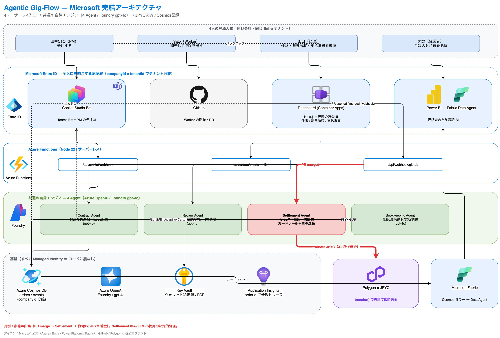
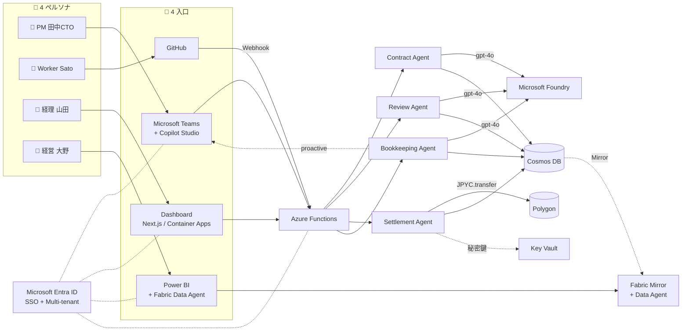

# Agentic Gig-Flow

> **副業3,000万人時代の月末経理を消す。** PR をマージした約3秒後に、円建てで報酬が着金する AI エージェントシステム。

[](https://zenn.dev/hackathons)
[](https://azure.microsoft.com/)
[](https://ai.azure.com/)
[](https://copilotstudio.microsoft.com/)
[](https://www.microsoft.com/en-us/microsoft-fabric)
[](https://www.microsoft.com/en-us/security/business/identity-access/microsoft-entra-id)

**Microsoft Agent Hackathon powered by Tokyo Electron Device / 個人部門 / 提出 2026-06-01**

---

## 🚀 提出物 (Submission)

| | リンク |
|---|---|
| 🎬 **デモ動画 (YouTube / 3分)** | **https://www.youtube.com/watch?v=6Uy_3ml6bxQ** |
| 📝 **Zenn 記事** | **https://zenn.dev/mameta29/articles/ddd4a08c23c571** |
| 🌐 **動作する Web アプリ (Dashboard)** | https://ca-gigflow-dashboard.mangomeadow-46aa4d19.japaneast.azurecontainerapps.io |
| 🏗 アーキテクチャ図 | [`docs/submission/architecture.png`](docs/submission/architecture.png) / [`.drawio`](docs/submission/architecture.drawio) / [`.svg`](docs/submission/architecture.svg) |
| 🎯 デモ手順 (Runbook) | [`docs/submission/demo-runbook.md`](docs/submission/demo-runbook.md) |
| 🎥 動画台本 | [`docs/submission/video-script.md`](docs/submission/video-script.md) |

---

## 🔑 審査員のみなさまへ（動作確認手順）

> 審査期間（2026/6/1〜6/18）中はデプロイ維持します。**シークレット / プライベートウィンドウ**でのアクセスを推奨します（他の Microsoft アカウントとのセッション競合回避のため）。

### Dashboard ログイン情報

| 項目 | 値 |
|---|---|
| URL | https://ca-gigflow-dashboard.mangomeadow-46aa4d19.japaneast.azurecontainerapps.io |
| ユーザー名 | `demo@MAMETAZK.onmicrosoft.com` |
| パスワード | `Gigflow-Judge-vpebfyem!` |

- 初回サインインでのパスワード変更・MFA 登録は **不要** です（デモテナントのため Security defaults は無効化済み）。
- 認証は **Microsoft Entra ID** マルチテナント。テナント `MAMETAZK` 内の正規メンバーアカウントです。

### 3分でわかる動作確認手順

1. 上記 URL にサインインすると、注文一覧が表示されます（過去案件・月次デモデータ・「+新規発注」ボタン）。
2. 任意の `bookkept` 案件（`/orders/[id]`）を開くと、**Bookkeeping Agent が生成した経理処理**が確認できます:
   - 仕訳: 借方 **外注費** / 貸方 **電子決済手段（JPYC）**
   - 源泉徴収判定（有無・税率・根拠）
   - 支払調書（Markdown）
   - 着金 tx hash → **Polygonscan** へのリンク
3. 「**+新規発注**」を押すと、PM 視点の発注フォームから **Contract Agent** が走り、GitHub Issue が自動で起票されます。
4. その Issue に対して PR を送ってマージすると、**Review → Settlement → Bookkeeping** が連鎖し、約3秒後に JPYC 着金 → PR に tx hash がコメント → Bookkeeping 結果が Dashboard と Teams に届きます（詳細は [`docs/submission/demo-runbook.md`](docs/submission/demo-runbook.md)）。

### ⚠️ お試し時のお願い

- **「一度に1 PR」ずつマージしてください**。同時に複数 PR をマージすると、Settlement Agent の安全ガード（idempotency / nonce）により空振りすることがあります（既知の挙動、コードでガード済み）。
- **Copilot Studio (Teams Bot)** は Viral Trial ライセンス制約で外部 Publish ができないため、デモ動画内の **Test pane 実演**でご確認ください（PM の発注 UI ＝ Adaptive Card で発注確認、Bookkeeping 完了通知の proactive 配信）。
- **Fabric Data Agent / Power BI** はデモ環境のキャパシティ運用上、動画内での録画でご確認ください（経営者ペルソナの自然言語問合せ → 月次業務委託費レポート）。

---

## 🎯 解こうとしている業務課題

**中小企業 × 副業フリーランサー** の業務委託フローは、今でも次のように回っています:

- 発注はメール／Slack で口頭ベース、契約書は別途 PDF
- 検収は人間が GitHub を覗いて目視確認
- 月末に Excel で報酬を集計、銀行サイトで個別振込（手数料数千円 × 件数）
- 海外フリーランサーへの着金は **3〜5営業日**
- 経理担当者は仕訳・源泉徴収・支払調書を毎月手作業
- 経営者が「今月のフリーランス費用いくら？」と聞くと数日かかる

副業人口が3,000万人に向かう日本で、**M365 を使っている中小企業の月末経理**がこのまま手作業で残るのは、AI 時代の損失です。

**Agentic Gig-Flow** は、この一連を **4 つの自律エージェント + Microsoft Cloud + JPYC（円建てステーブルコイン）** で消します。

### Before / After (業務委託先5名 / 月)

| | Before | After |
|---|---|---|
| 発注 | メール／電話／Excel | **Teams で Copilot Studio に一言** |
| 進捗 | 個別 Slack 追跡 | GitHub Issue が単一情報源 |
| 検収 | 人間の目視レビュー | **Review Agent が PR を解析 + 承認** |
| 報酬計算 | 月末 Excel 集計 | Settlement Agent が PR マージ直後に実行 |
| 振込 | 銀行サイト・3〜5日・数千円手数料 | **JPYC で約3秒・実質ゼロ円** |
| 仕訳・源泉徴収 | 月末まとめて手作業 | Bookkeeping Agent が即時生成 |
| 経理担当の確認 | スプレッドシート巡回 | Dashboard で注文ごとに仕訳・支払調書が見える |
| 経営者の月次把握 | 経理へ依頼 → 数日 | **Power BI + Fabric Data Agent に質問 → 即答** |
| 監査証跡 | 紙・PDF・分散 | Cosmos DB + Polygon オンチェーン |

**数値インパクト (1社/月)**: 経理工数 20h → 1h (-95%) ／ 振込手数料 50,000円 → ≈0円 (-99%) ／ 入金待機 3–5日 → 3秒 ／ 月次集計依頼 数日 → 1分

---

## 🏗 アーキテクチャ



> 編集可能版: [`docs/submission/architecture.drawio`](docs/submission/architecture.drawio) ／ SVG 版: [`docs/submission/architecture.svg`](docs/submission/architecture.svg)

### 4人の登場人物と4つの入口

| 役割 | ペルソナ | 入口 |
|---|---|---|
| **PM (発注)** | 田中CTO (合同会社マルシュ) | Microsoft Teams + **Copilot Studio** |
| **Worker (受注)** | Sato (海外フリーランサー) | **GitHub** (PR を出すだけ) |
| **経理担当** | 山田さん | **Dashboard** (Next.js on Container Apps) |
| **経営者** | 大野社長 | **Power BI + Fabric Data Agent** |

### 業務フロー（ざっくり読み下し）

1. **PM → Copilot Studio Agent** が Adaptive Card で発注確認 → Azure Functions の `OrderCreate` を呼ぶ。
2. **Contract Agent (Foundry / gpt-4o)** が自然文要求を構造化し、検収基準を生成、GitHub Issue を作成、Cosmos に Order を保存。
3. **Worker (人間) が GitHub で PR を提出**。GitHub Webhook → Azure Functions。
4. **Review Agent (gpt-4o)** が diff + 検収基準を **逐語的に** 評価し、APPROVE / REQUEST_CHANGES を投稿。合格なら merge。
5. **Settlement Agent (決定的処理 / LLM 非使用)** が `viem` で JPYC `transfer()` を Polygon に発行 → 約3秒で着金 → tx hash を PR にコメント。
6. **Bookkeeping Agent (gpt-4o)** が仕訳（借方 外注費 / 貸方 **電子決済手段（JPYC）**）・源泉徴収判定・支払調書を生成し Cosmos へ。完了通知を Copilot Studio 経由で Teams に proactive 配信。
7. **経理担当 (山田さん)** は Dashboard で注文ごとの仕訳・源泉徴収・支払調書・着金 tx を一画面で確認。
8. **経営者 (大野さん)** は **Microsoft Fabric** にミラーされた Cosmos データを **Power BI** で月次可視化し、**Fabric Data Agent** に自然言語で問い合わせ。

すべての入口は **Microsoft Entra ID** で SSO 統一、サービス間呼び出しは **Managed Identity (Key Vault / Cosmos / Foundry)** で鍵レス。

詳細: [`docs/01-architecture.md`](docs/01-architecture.md)

### システム関係図 (Mermaid)



---

## 🧠 4 つのエージェント

| Agent | 駆動 | 役割 |
|---|---|---|
| **Contract** | gpt-4o + function calling | 自然文 → 構造化発注、検収基準生成、GitHub Issue 起票、Cosmos 保存 |
| **Review** | gpt-4o + function calling | PR diff を **逐語的に** 検収基準と突合、証拠引用、APPROVE / REQUEST_CHANGES を投稿 |
| **Settlement** | **決定的処理（LLM なし、意図的）** | JPYC `transfer()` を viem で発行、receipt 待機、tx hash を PR コメント |
| **Bookkeeping** | gpt-4o (tool なし、出力 JSON 制約) | 仕訳・源泉徴収判定（4パターン）・支払調書 Markdown 生成、Teams へ proactive 通知 |

**Settlement が LLM を使わないのは意図的な設計判断**です。金銭処理は推論より決定的・監査可能であるべきで、代わりに以下をコードで縛っています:

- `MAX_AMOUNT_PER_TX = 100,000 JPYC` / `MAX_TX_PER_DAY = 10`
- アドレスチェックサム検査
- `txHash` idempotency（同一 Order からの多重送金を Cosmos でブロック）

System Prompt と Tool 定義の全文: [`docs/02-agents.md`](docs/02-agents.md)

---

## 🛠 技術スタック

### Microsoft Cloud（フル採用）

| 層 | プロダクト | 役割 |
|---|---|---|
| 実行基盤 | **Azure Functions** | Webhook / HTTP / Agent オーケストレーション (Node 22) |
| 実行基盤 | **Azure Container Apps** | Dashboard (Next.js) と MCP Server をホスト |
| 生成 AI | **Microsoft Foundry (Azure OpenAI gpt-4o)** | Contract / Review / Bookkeeping の関数呼び出し |
| エージェント UI | **Microsoft Copilot Studio** | PM 向け Teams Bot（発注 + 通知 + Adaptive Card） |
| データ × AI | **Microsoft Fabric** | Cosmos ミラー + Power BI + **Data Agent**（経営者の自然言語問合せ） |
| ID | **Microsoft Entra ID** | SSO + マルチテナント（`companyId = tenantId`） |
| データ | **Azure Cosmos DB** | orders / events / accounts / tenants (partition by companyId) |
| シークレット | **Azure Key Vault** | ウォレット秘密鍵 / GitHub PAT / Webhook secret（Managed Identity で鍵レス参照） |
| 可観測性 | **Azure Application Insights** | 構造化ログ（pino）+ Agent 別分散トレース |
| ソース管理 | **GitHub** | Webhook（PR/CI イベント）+ Octokit（Issue / Review / Merge） |

### Web3

- **Polygon mainnet** + **JPYC**（日本円ステーブルコイン）
- **`viem`** で `transfer()` 直叩き（Settlement Agent が EOA + MATIC 保有のため EIP-3009 不採用）

### 言語・ランタイム

- **TypeScript 5+ (strict)** / **Node.js 22** / **pnpm workspaces**
- Frontend: **Next.js 15 (App Router) + Tailwind v4 + NextAuth (Entra ID)**

---

## ✅ ハッカソン要件への充足

Microsoft Agent Hackathon 2026 仕様への対応表:

| 仕様書要件 | 充足 | 参照 |
|---|---|---|
| **【必須】Azure 実行基盤** | Azure Functions ＋ Azure Container Apps ＋ Copilot Studio | [`docs/04-azure-setup.md`](docs/04-azure-setup.md) |
| **【必須】Microsoft AI 技術** (1つ以上) | Foundry (gpt-4o) **＋** Copilot Studio **＋** Fabric Data Agent（3種） | [`docs/02-agents.md`](docs/02-agents.md), [`docs/08-copilot-studio.md`](docs/08-copilot-studio.md), [`docs/11-fabric.md`](docs/11-fabric.md) |
| 【推奨】Azure Cosmos DB | ✅ orders / events / accounts / tenants | [`docs/01-architecture.md`](docs/01-architecture.md) §4 |
| 【推奨】GitHub | ✅ Webhook + Octokit（Issue / Review / Merge） | [`docs/05-github-setup.md`](docs/05-github-setup.md) |
| 【推奨】Microsoft Power Platform | ✅ Copilot Studio（Teams Bot）+ Power BI | [`docs/08-copilot-studio.md`](docs/08-copilot-studio.md) |
| 【推奨】Microsoft Entra ID | ✅ マルチテナント（5 App Registrations） | [`docs/10-entra-id.md`](docs/10-entra-id.md) |

### 審査軸への自己評価

1. **ビジネスインパクト** — **M365 を使う中小企業の月末経理が消える**、という既存 MS 顧客に直結する改革。具体ペルソナ（合同会社マルシュ田中CTO ／ フリーランサー Sato ／ 経理 山田 ／ 経営 大野）の Before/After で示しています。
2. **アプローチの有効性** — 4 Agent + Copilot Studio + Fabric Data Agent が **役割分担して並行動作する Agentic 設計**。Settlement を意図的に決定的処理にして、金銭処理の安全性とエージェント自律性のバランスを取っています。
3. **完成度・実現性** — 全層 Azure 上で常時稼働中。テスト ≈ 900 行（Vitest）。Entra マルチテナント、Managed Identity、Key Vault、上限ガード、idempotency、構造化ログまで実装済み。審査員が触れる Dashboard を公開・ログイン情報も本 README とフォームに記載。

---

## 🔐 セキュリティ / 運用

- 秘密鍵・PAT・Webhook secret は **Azure Key Vault** に保管、Functions / Dashboard / MCP は **Managed Identity** で参照
- GitHub Webhook は **HMAC-SHA256 (`X-Hub-Signature-256`) 検証** 必須
- Cosmos クエリは全て `companyId = ctx.tenantId` で **テナント分離**
- JPYC 送金: **`MAX_AMOUNT_PER_TX = 100,000 JPYC` / `MAX_TX_PER_DAY = 10` / アドレス検査 / `txHash` idempotency**
- ログ: pino による構造化ログ → Application Insights、Agent ごとに分散トレース

---

## 🚀 ローカル開発（任意）

```bash
# 前提: Node.js 22+, pnpm 9+, Azure CLI, Azure サブスクリプション, Microsoft 365 (Copilot Studio用)
git clone https://github.com/Mameta29/agentic-gig-flow.git
cd agentic-gig-flow
pnpm install

# 環境変数
cp .env.example .env

# ローカル起動
pnpm --filter functions dev      # Azure Functions Core Tools
pnpm --filter dashboard dev      # Next.js Dashboard
pnpm --filter mcp-server dev     # gigflow-mcp Server (任意)

# テスト
pnpm test
```

Azure 環境の構築手順: [`docs/04-azure-setup.md`](docs/04-azure-setup.md) / [`docs/10-entra-id.md`](docs/10-entra-id.md) / [`docs/11-fabric.md`](docs/11-fabric.md)

---

## 📁 リポジトリ構成

```
agentic-gig-flow/
├── README.md                       # 本ファイル
├── CLAUDE.md                       # AI エージェント向け作業指示書
├── docs/
│   ├── 01-architecture.md          # システム構成 + Cosmos スキーマ
│   ├── 02-agents.md                # 4 Agent の System Prompt と Tools
│   ├── 04-azure-setup.md           # Azure リソース構築手順
│   ├── 05-github-setup.md          # GitHub repo + Webhook
│   ├── 08-copilot-studio.md        # Copilot Studio Bot + Adaptive Card
│   ├── 10-entra-id.md              # Entra ID マルチテナント
│   ├── 11-fabric.md                # Fabric Data Agent + Power BI
│   ├── 15-end-to-end-flow.md       # エンドツーエンド業務シーケンス
│   └── submission/                 # ハッカソン提出物
│       ├── architecture.{png,svg,drawio}
│       ├── demo-runbook.md         # 審査員向け再現手順
│       ├── video-script.md         # 3分動画台本
│       ├── zenn-article.md         # Zenn 投稿原稿
│       └── zenn-article_v2.md      # MS 完結ナラティブ版
├── packages/
│   ├── functions/                  # Azure Functions (4 Agent 本体)
│   ├── dashboard/                  # Next.js Dashboard (Container Apps)
│   ├── mcp-server/                 # gigflow-mcp (実装済・提出物には前面化せず)
│   └── shared/                     # 共通型定義
└── pnpm-workspace.yaml
```

---

## 📜 ライセンス

MIT

---

## 👤 作者

吉川 真瑛 ([@Mameta29](https://github.com/Mameta29)) — JPYC エンジニア / Microsoft Agent Hackathon 2026 個人部門参加
