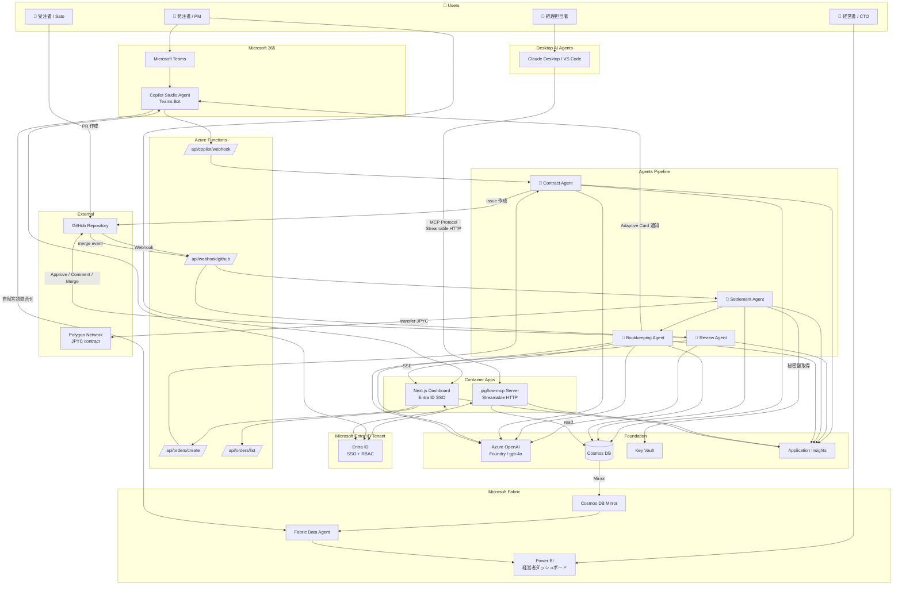
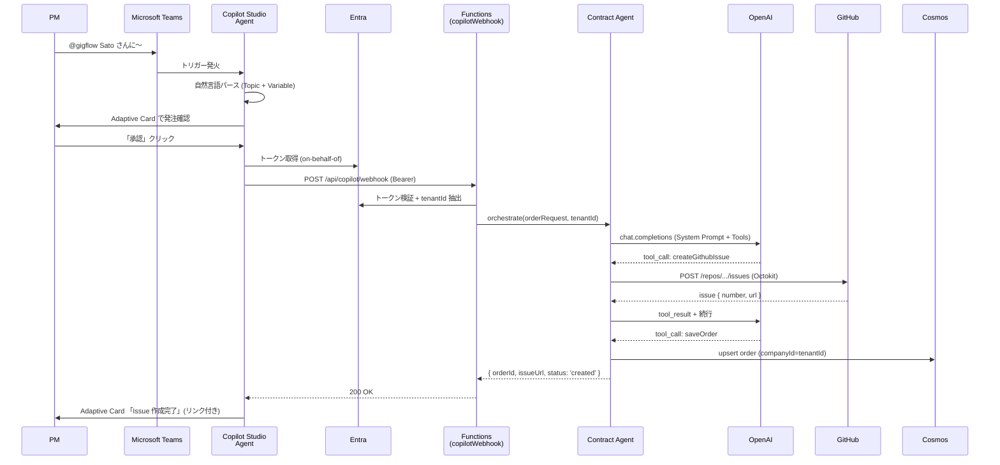
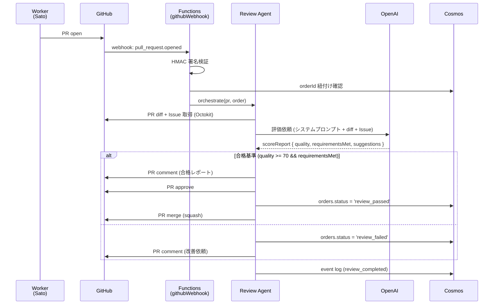
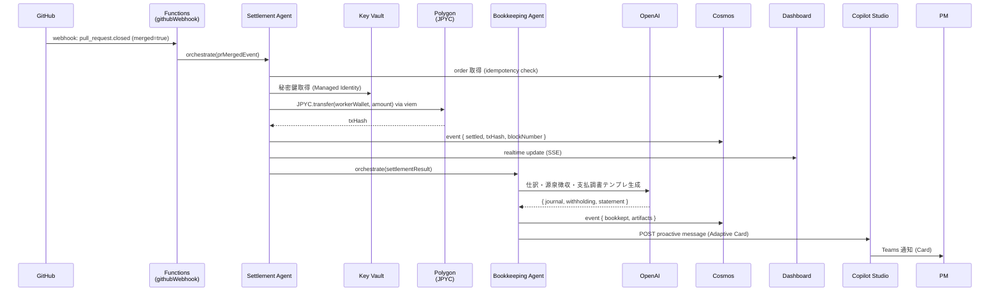
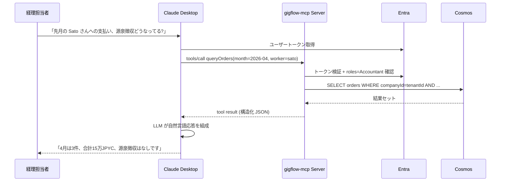
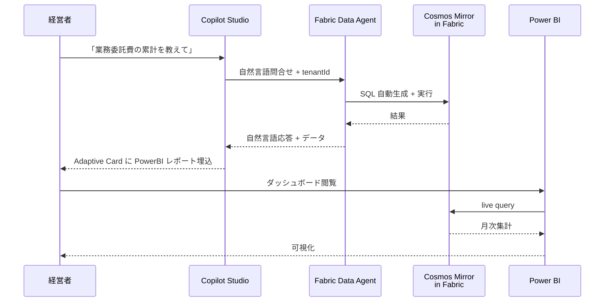

# 01. アーキテクチャ

## 1. 全体構成図



### この図のポイント
- **PM の発注経路は Copilot Studio が主、Dashboard はバックアップ + 状態可視化**
- **経理担当者は Claude Desktop / VS Code から MCP サーバ経由で問い合わせ** (Multi-agent 経路)
- **経営者は Power BI を見るだけ。裏では Fabric Data Agent が自然言語問合せに応える**
- **Copilot Studio から Fabric Data Agent への直接問合せ経路もある** (例: 「先月の総支払額」)
- **Entra ID がすべてのフロントドア (Teams / Dashboard / MCP / Power BI) を統括**

---

## 2. コンポーネント責務

### 2.1 Copilot Studio Agent (`docs/08-copilot-studio.md`)
**Microsoft Teams 上の Bot として配信。PM の発注 UI の主経路。**
- Trigger phrases: `@gigflow 発注`, `Sato さんに〜お願い` 等
- HTTP action で Functions の `/api/copilot/webhook` を叩く
- Adaptive Card で:
  - 発注確認カード (PM が承認 / 修正)
  - Bookkeeping 完了通知カード (仕訳・支払調書ダウンロード、Polygonscan リンク)
  - 月次レポート要約カード (Fabric Data Agent からの自然言語応答を埋め込み)

### 2.2 Web Dashboard (`packages/dashboard/`)
**Next.js 15 App Router、Container Apps にホスト、Entra ID SSO 必須。**
- 発注フォーム (PM 用、Copilot Studio が使えない場合のバックアップ)
- 注文一覧 / ステータス可視化 (リアルタイム更新)
- 監査ログビューア
- 受注者向け公開URL (各注文の状態とTxHash表示、こちらは認証不要)

### 2.3 MCP Server (`packages/mcp-server/`、`docs/09-mcp-server.md`)
**`gigflow-mcp` という独立 MCP サーバ。Container Apps にホスト、Streamable HTTP トランスポート (SSE は legacy フォールバック)。**
- 経理担当者の Claude Desktop / Cursor / VS Code から接続
- Copilot Studio からも MCP connector で呼べる
- Tools:
  - `queryOrders(filter)` — 月次・受注者別・ステータス別で order 取得
  - `getJournalEntries(month)` — その月の仕訳一覧 (Bookkeeping Agent 出力)
  - `getWithholdingReport(workerId, year)` — 年間源泉徴収レポート
  - `exportPaymentStatement(orderId)` — 支払調書 Markdown
  - `getMonthlyTotals(month)` — 月次合計 (経理締め用)
- Resources (詳細は `docs/09-mcp-server.md` §4):
  - `gigflow://orders/{orderId}`
  - `gigflow://accounts/{accountId}`
  - `gigflow://journal/{yearMonth}`
  - `gigflow://reports/withholding/{worker}/{year}`
- 認証: Entra ID トークン (Bearer)、tenant scoping

### 2.4 Azure Functions (`packages/functions/`)
HTTP / Webhook トリガーで起動するサーバーレス層。

| Function | Trigger | 起動するAgent |
|---|---|---|
| `ordersCreate` | HTTP POST `/api/orders/create` | Contract |
| `ordersList` | HTTP GET `/api/orders/list` | (なし、CosmosからDirect read) |
| `githubWebhook` | HTTP POST `/api/webhook/github` | Review (PR時) → Settlement (merge時) → Bookkeeping |
| `copilotWebhook` | HTTP POST `/api/copilot/webhook` | Contract |

すべて Entra ID トークン検証 (Functions 標準の Easy Auth は使わず、ミドルウェアで JWT 検証)。

### 2.5 Agents (`packages/functions/src/agents/`)
Agent は**「特定のSystem Prompt + Tools を持つ Azure OpenAI コール + 後処理」**として実装。クラスではなく関数として書く。
詳細は `docs/02-agents.md` 参照。

### 2.6 Microsoft Fabric (`docs/11-fabric.md`)
- **Cosmos DB Mirror**: orders / events を Fabric にミラーリング (zero-ETL)
- **Data Agent**: スキーマを与え、自然言語で問い合わせ可能 (例: "先月の Sato さんへの支払い合計")
- **Power BI**: 経営者向けダッシュボード (月次業務委託費 / 受注者ランキング / 平均リードタイム)
- Copilot Studio から Data Agent を呼ぶ経路あり

### 2.7 Foundation Services
- **Azure OpenAI (Foundry)**: gpt-4o for tool-calling、JSONモード
- **Cosmos DB**: orders / events / accounts コレクション、partition by companyId
- **Key Vault**: ウォレット秘密鍵、GitHub PAT、Webhook secret、Entra アプリ secret
- **Application Insights**: 構造化ログ、Agent別トレース、Multi-agent 呼び出しの分散トレース
- **Microsoft Entra ID**: SSO、マルチテナント、ロール (`PM`, `Accountant`, `Executive`)

---

## 3. データフロー (シーケンス図)

### 3.1 発注 → Contract Agent (Copilot Studio 経由)



### 3.2 PR作成 → Review Agent → 自動マージ



### 3.3 マージ → Settlement → Bookkeeping → Copilot Studio 通知 ★ 山場



### 3.4 経理担当者の問合せ (MCP 経由)



### 3.5 経営者ビュー (Fabric Data Agent + Power BI)



---

## 4. データモデル (Cosmos DB)

### 4.1 Database / Containers

- Database: `gigflow`
- Containers:
  - `orders` (partition key: `/companyId`)
  - `events` (partition key: `/orderId`)
  - `accounts` (partition key: `/id`)
  - `tenants` (partition key: `/id`) — Entra tenantId と companyId のマップ + 設定

### 4.2 `orders` コンテナ

```ts
// packages/shared/src/types/order.ts
export type OrderStatus =
  | 'created'           // Contract Agent 完了
  | 'in_progress'       // Worker が assigned, PR 未作成
  | 'pr_opened'         // PR 作成済み、Review 待ち
  | 'review_failed'     // Review が NG、修正待ち
  | 'review_passed'     // Review 通過、マージ待ち or マージ済み
  | 'settled'           // JPYC 送金完了
  | 'bookkept'          // 経理処理完了
  | 'cancelled';

export type Order = {
  id: string;                     // UUID
  companyId: string;              // partition key (= Entra tenantId)
  requesterId: string;            // PM の Entra objectId
  workerGithubLogin: string;
  workerWallet: string;           // 受注者の EVM address (0x...)
  description: string;
  acceptanceCriteria: string[];
  amountJpyc: number;
  deadline: string;               // ISO 8601
  repository: string;             // "owner/repo"
  issueNumber?: number;
  issueUrl?: string;
  prNumber?: number;
  prUrl?: string;
  status: OrderStatus;
  txHash?: string;
  blockNumber?: number;
  settledAt?: string;             // Settlement Agent が transfer 確定時刻を ISO 8601 で記録
  bookkeepingArtifacts?: {
    journalEntry: JournalEntry;
    withholding: WithholdingDecision;
    paymentStatementMarkdown: string;
    needsHumanReview: boolean;    // 税理士確認推奨フラグ (源泉徴収の判定が曖昧な場合 true)
    generatedAt: string;
  };
  copilotConversationRef?: ConversationReference;  // Bookkeeping から proactive 通知に使う Bot Framework の参照
  createdAt: string;
  updatedAt: string;
};
```

### 4.3 `events` コンテナ

```ts
// packages/shared/src/types/event.ts
export type AgentName = 'contract' | 'review' | 'settlement' | 'bookkeeping' | 'mcp';

export type EventType =
  | 'order_created'
  | 'issue_created'
  | 'pr_opened'
  | 'review_started'
  | 'review_completed'
  | 'review_failed'
  | 'pr_merged'
  | 'settlement_started'
  | 'settlement_completed'
  | 'settlement_failed'
  | 'bookkeeping_started'
  | 'bookkeeping_completed'
  | 'mcp_query'                   // MCP tool call
  | 'copilot_card_sent';          // Copilot Studio proactive message

export type Event = {
  id: string;
  orderId: string;                // partition key
  agent?: AgentName;
  type: EventType;
  payload: Record<string, unknown>;
  actorId?: string;               // Entra objectId of triggering user
  createdAt: string;
};
```

### 4.4 `accounts` コンテナ

```ts
// packages/shared/src/types/account.ts
export type AccountRole = 'PM' | 'Accountant' | 'Executive' | 'Worker';

export type Account = {
  id: string;                     // partition key (UUID または `<companyId>:<workerGithubLogin>` 等の合成キー)
  companyId: string;
  type: 'company' | 'worker';
  displayName: string;
  entraObjectId?: string;         // company users only
  roles: AccountRole[];
  // company 特有
  company?: {
    spendingLimitMonthly?: number;
    spendingLimitPerOrder?: number;
  };
  // worker 特有
  worker?: {
    githubLogin: string;
    wallet: string;
    countryCode?: string;
    timezone?: string;
  };
  createdAt: string;
};
```

### 4.5 `tenants` コンテナ

```ts
// packages/shared/src/types/tenant.ts
export type Tenant = {
  id: string;                     // = companyId = Entra tenantId
  displayName: string;
  defaultRepository?: string;
  defaultCurrency: 'JPYC';
  fabricWorkspaceId?: string;     // Fabric ワークスペース紐付け
  copilotStudioBotId?: string;
  createdAt: string;
};
```

---

## 5. ID と Idempotency

- `Order.id`: UUID v4。Contract Agent が生成。
- `companyId`: Entra `tenantId` をそのまま使用 (マルチテナント分離の根拠)。
- GitHub Issue 本文の末尾に隠しコメント `<!-- gigflow:orderId=<uuid> -->` を埋め込み、PR/merge イベント受信時に紐付け。

### 状態遷移の責任分担

| 状態 | 書込責任 | トリガー |
|---|---|---|
| `created` | Contract Agent | Issue 作成成功時 |
| `pr_opened` | GitHub Webhook handler (Review 起動前) | `pull_request.opened` |
| `review_passed` | Review Agent | verdict === 'approve' 時 (mergePr 呼出前) |
| `review_failed` | Review Agent | verdict === 'reject' 時 |
| `settled` | Settlement Agent | transferJpyc + receipt 確定時 |
| `bookkept` | Bookkeeping Agent (orchestrator) | OpenAI 出力 + Cosmos 保存完了時 |
| `cancelled` | Dashboard / Copilot Studio (manual) | PM の明示操作 |

- **Settlement の Idempotency**: Cosmos の `orders.txHash` が空かつ `status === 'review_passed'` の時のみ実行。並行実行は Cosmos の楽観ロック (`_etag`) で防御。
- **不正な遷移は wrapper で reject**: 例えば `created` から直接 `settled` への遷移は許可しない (`packages/functions/src/lib/cosmos.ts` の `transitionStatus(from, to)` ヘルパで判定)。
- **MCP tool 呼び出し**はクエリ結果に対してキャッシュなし (常に最新)。書込系 tool は提供しない (read-only)。

---

## 6. セキュリティ・モデル

### 6.1 認証・認可マトリクス

| 経路 | 入口 | 認証 | 認可 |
|---|---|---|---|
| PM → Copilot Studio | Teams | Entra (Teams ID) | tenantId のメンバーシップ |
| PM → Dashboard | ブラウザ | Entra (MSAL) | role: PM |
| 経理 → Claude Desktop → MCP | HTTPS | Entra (Bearer JWT) | role: Accountant |
| 経営者 → Power BI | ブラウザ | Entra (Power BI) | Fabric workspace permission |
| Copilot Studio → Functions | HTTP action | Entra (on-behalf-of) | service principal |
| MCP → Cosmos | SDK | Managed Identity | Cosmos DB Built-in Data Reader (read-only) |
| Functions → Cosmos | SDK | Managed Identity | Cosmos DB Built-in Data Contributor (read/write) |
| Functions → Key Vault | SDK | Managed Identity | Secrets User |
| Functions → OpenAI | SDK | Managed Identity | Cognitive Services OpenAI User |

### 6.2 資産保管

| 資産 | 保管先 | アクセス方法 |
|---|---|---|
| 法人ウォレット秘密鍵 | Key Vault Secret | Managed Identity (Functions のシステム割当) |
| GitHub PAT | Key Vault Secret | Managed Identity |
| GitHub Webhook secret | Key Vault Secret | Functions 内で HMAC 検証 |
| Cosmos DB 接続 | Cosmos の RBAC | Managed Identity |
| Azure OpenAI | OpenAI の RBAC | Managed Identity |
| Entra App Secret (Copilot Studio) | Key Vault Secret | Bot framework |

### 6.3 送金前ガードレール

```ts
// packages/functions/src/agents/settlement.ts (の簡略形)
const MAX_AMOUNT_PER_TX = 100_000;     // JPYC
const MAX_TX_PER_DAY_PER_AGENT = 10;
const ALLOWED_RECIPIENTS_REGEX = /^0x[a-fA-F0-9]{40}$/;

function preTransferChecks(order: Order, dailyTxCount: number) {
  if (order.amountJpyc > MAX_AMOUNT_PER_TX) throw new Error('amount exceeded');
  if (dailyTxCount >= MAX_TX_PER_DAY_PER_AGENT) throw new Error('daily limit');
  if (!ALLOWED_RECIPIENTS_REGEX.test(order.workerWallet)) throw new Error('bad address');
  // 履歴検査: 同一 recipient への直近送金を Cosmos で確認 (typo早期検出)
}
```

### 6.4 テナント分離 (Multi-tenant security)

すべての Cosmos クエリは `companyId = ctx.tenantId` で絞る。`lib/cosmos.ts` のラッパで強制:

```ts
// 危険: 直接 query するな
// 安全: createTenantScopedClient(tenantId) を経由する
```

---

## 7. デプロイ・トポロジー

```
[Microsoft Entra ID Tenant: gigflow-demo]
└── [Subscription: Pay-As-You-Go]
    └── [Resource Group: rg-gigflow-prod]
        ├── Function App: func-gigflow (Consumption Plan)
        ├── Container Apps Environment: cae-gigflow
        │   ├── Container App: ca-gigflow-dashboard (Next.js)
        │   └── Container App: ca-gigflow-mcp (gigflow-mcp server)
        ├── Azure OpenAI: aoai-gigflow (Japan East / East US 2)
        ├── Cosmos DB: cosmos-gigflow (Free tier、Serverless)
        ├── Key Vault: kv-gigflow
        ├── Application Insights: ai-gigflow
        ├── Log Analytics Workspace: log-gigflow
        ├── Microsoft Fabric capacity: fab-gigflow (Trial 可)
        │   ├── Workspace: ws-gigflow
        │   ├── Mirrored Database (from Cosmos)
        │   ├── Data Agent: da-gigflow
        │   └── Power BI Report: pbi-gigflow-monthly
        └── Entra App Registrations (multi-tenant、5種):
            ├── app-gigflow-dashboard (SPA / public client)
            ├── app-gigflow-functions (Web API、scope: orders.write / orders.read、roles: PM)
            ├── app-gigflow-mcp (Web API、scope: mcp.read、roles: Accountant / Executive)
            ├── app-gigflow-copilot (Bot Framework + delegated client)
            └── app-gigflow-fabric (Web API、scope: data.read、Data Agent 呼出に使う audience)
```

リージョン推奨: **Japan East**。OpenAI のモデル可用性で問題があれば East US 2 にフォールバック。

---

## 8. パフォーマンス目標 (デモ要件から逆算)

- PR merge から JPYC 送金 txHash 生成まで: **3秒以内** (95% percentile)
  - Webhook受信 → Settlement 起動: 100ms
  - Cosmos からの order 取得: 50ms
  - Key Vault 秘密鍵取得 (キャッシュ): 0ms (cold時 200ms)
  - viem `writeContract`: 200ms (Polygon RPC)
  - ブロック確定 (1 block): ~2秒
- Review Agent 完了: **30秒以内** (gpt-4o の最大思考時間想定)
- MCP tool レスポンス: **1秒以内** (シンプルなクエリ)
- Copilot Studio Adaptive Card 表示: PR merge から **5秒以内**

---

## 9. 観測性 (Observability)

Application Insights のカスタムイベントで Multi-agent トレースを成立させる:

```
correlation_id (orderId)
├── copilot_request_received
├── functions_orders_create_received
├── contract_agent_started
│   ├── openai_call (validate)
│   ├── github_create_issue
│   └── cosmos_upsert_order
├── github_webhook_received
├── review_agent_started
│   ├── openai_call (review)
│   └── github_merge
├── settlement_started
│   ├── keyvault_get_secret
│   ├── polygon_transfer
│   └── cosmos_update_order
├── bookkeeping_started
│   ├── openai_call (journal)
│   └── copilot_proactive_message_sent
└── mcp_query (later, by accountant)
```

これで「**1 つの orderId で全 Agent の動きが時系列に並ぶ**」絵がデモで使える。

---

## 10. 落とし穴・既知の課題

- **Polygon RPC のレート制限**: パブリック RPC では本番運用に不向き。Alchemy / QuickNode の無料枠を使う。
- **Cosmos DB のクエリ料金**: SELECT * はRU高消費。Status / 期間フィルタは partition key + ORDER BY id DESC で。
- **Azure OpenAI の concurrent limit**: TPM (Token Per Minute) と RPM の両方に注意。デモ撮影時のために本番より高めの quota を申請しておく。
- **Webhook の Replay 攻撃**: GitHub の delivery_id をCosmosで重複検査する。
- **Copilot Studio の HTTP action タイムアウト**: 30秒。Contract Agent が長引く場合は acknowledgement → 非同期通知 + Adaptive Card 後送パターンに切り替える。
- **Fabric Mirror のレイテンシ**: 最短でも数十秒〜数分。リアルタイム性が必要な経理問合せは MCP → Cosmos 直読みを使う。Fabric は経営者向け集計用に限定。
- **MCP Streamable HTTP 経路**: Container Apps の Ingress で長時間 HTTP を許容する設定を確認。SSE フォールバックはプロキシのタイムアウトで切れることがあるため Streamable HTTP を主とする。
