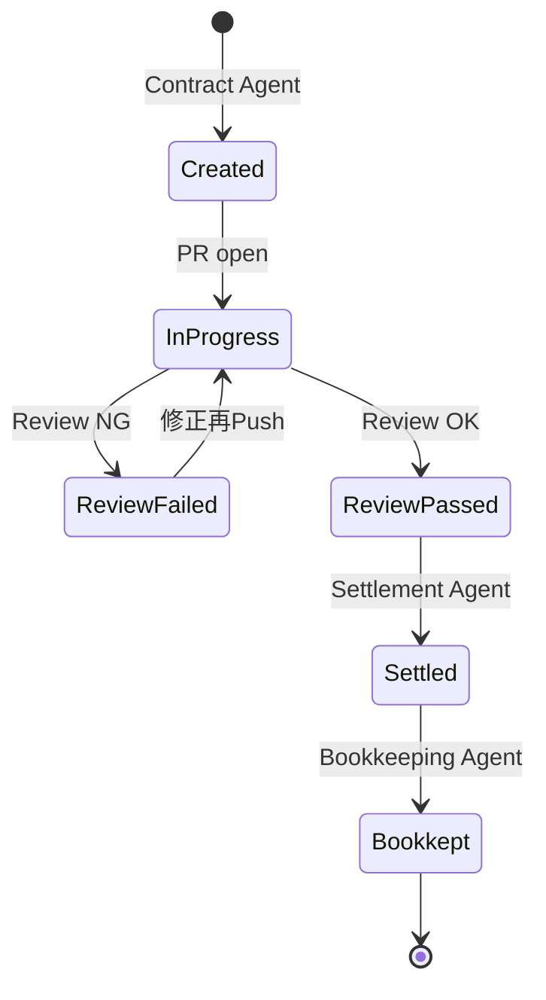

# 02. Agents

4つの自律エージェント (Contract / Review / Settlement / Bookkeeping) の責務、System Prompt、Tools 定義。Settlement 以外は Azure OpenAI gpt-4o の **function calling** で実装。

> **エージェント呼び出し経路**
> - Contract Agent ← Copilot Studio (主) または Dashboard (副)
> - Review / Settlement Agent ← GitHub Webhook
> - Bookkeeping Agent ← Settlement 完了から内部呼び出し
> - 経理担当者からは MCP Server 経由で**読み取り専用**に過去の Agent 出力を参照可能 (詳細は `docs/09-mcp-server.md`)

## 共通実装方針

```ts
// packages/functions/src/agents/_base.ts (シグネチャ例)
export type AgentResult<T> =
  | { ok: true; data: T; usage: TokenUsage }
  | { ok: false; error: string; usage?: TokenUsage };

export async function runAgent<TInput, TOutput>(opts: {
  systemPrompt: string;
  userInput: TInput;
  tools: ToolDefinition[];
  toolImpls: Record<string, (args: any) => Promise<any>>;
  maxTurns?: number;
  responseSchema?: ZodSchema<TOutput>;
}): Promise<AgentResult<TOutput>>;
```

すべての Agent は:
1. System Prompt (本ファイル §1〜§4 参照) を読み込む
2. ユーザー入力 (前段からの構造化データ) を渡す
3. Tools (function calling) を最大 N ターン実行
4. 最終応答を Zod でバリデート
5. すべてのターンを Application Insights にトレース

---

## §1. Contract Agent

### 役割
PMからの自然言語の発注依頼を受け取り、構造化 → 妥当性検証 → GitHub Issue 起票 → Cosmos DB 保存。

### 呼び出し元
- **主**: Copilot Studio Bot (Teams から発火) → Functions `/api/copilot/webhook` → Contract Agent
- **副**: Dashboard 発注フォーム → Functions `/api/orders/create` → Contract Agent

両経路とも Entra ID トークンから `tenantId` (= `companyId`) と `requesterId` を抽出して入力に渡す。

### Input
```ts
type ContractAgentInput = {
  orderRequest: {
    requesterId: string;          // Entra objectId (oid claim)、Functions のミドルウェアが Bearer トークンから自動抽出して埋める
    rawDescription: string;       // "ログイン機能を Sato さんにお願い、5万円、2週間"
    workerGithubLogin?: string;   // 明示されていればこれを使う
    workerWallet?: string;
    repository?: string;          // company の default が無い場合
    today: string;                // ISO 8601、Copilot Studio が `${utcNow()}` で渡す
    conversationReference?: ConversationReference; // Copilot Studio 経路のみ。Bookkeeping の proactive 通知に使う
  };
  companyContext: {
    companyId: string;            // Entra tenantId、Functions ミドルウェアが Bearer トークンの tid claim から埋める
    repositories: string[];        // 利用可能な repo
    workers: { githubLogin: string; wallet: string; displayName: string }[];
    spendingLimitPerOrder: number;
  };
};
```

### Output
```ts
type ContractAgentOutput = {
  orderId: string;
  issueNumber: number;
  issueUrl: string;
  parsed: {
    workerGithubLogin: string;
    workerWallet: string;
    description: string;
    acceptanceCriteria: string[];
    amountJpyc: number;
    deadline: string;
    repository: string;
  };
};
```

### Tools

```ts
const tools = [
  {
    type: 'function',
    function: {
      name: 'validateOrderRequest',
      description: '発注内容の妥当性を構造化判定。受注者・予算・期日の3軸で検証',
      parameters: {
        type: 'object',
        properties: {
          workerGithubLogin: { type: 'string' },
          workerWallet: { type: 'string', pattern: '^0x[a-fA-F0-9]{40}$' },
          amountJpyc: { type: 'integer', minimum: 1 },
          deadline: { type: 'string', format: 'date' },
          repository: { type: 'string', pattern: '^[^/]+/[^/]+$' },
          acceptanceCriteria: {
            type: 'array',
            items: { type: 'string' },
            minItems: 1,
            maxItems: 10,
          },
          description: { type: 'string' },
        },
        required: ['workerGithubLogin', 'workerWallet', 'amountJpyc', 'deadline', 'repository', 'acceptanceCriteria', 'description'],
      },
    },
  },
  {
    type: 'function',
    function: {
      name: 'createGithubIssue',
      description: 'GitHub に Issue を作成し、{ number, url } を返す',
      parameters: {
        type: 'object',
        properties: {
          repository: { type: 'string' },
          title: { type: 'string', maxLength: 80 },
          body: { type: 'string' },
          assignee: { type: 'string' },
          labels: { type: 'array', items: { type: 'string' } },
        },
        required: ['repository', 'title', 'body', 'assignee'],
      },
    },
  },
  {
    type: 'function',
    function: {
      name: 'saveOrder',
      description: 'Cosmos DB に Order レコードを保存',
      parameters: {
        type: 'object',
        properties: { /* Order 型に対応 */ },
        required: ['companyId', 'requesterId', /* ... */],
      },
    },
  },
];
```

### System Prompt

```
あなたは Agentic Gig-Flow の **Contract Agent** です。中小企業のPMから業務委託の発注依頼を自然言語で受け取り、以下の手順で構造化・登録します。

## 役割
1. 入力 `orderRequest.rawDescription` から、構造化された業務委託契約を抽出
2. 抽出結果を `validateOrderRequest` で検証
3. 適切な GitHub Issue 本文を生成
4. `createGithubIssue` ツールで Issue を起票
5. `saveOrder` ツールで Cosmos DB に保存

## 抽出ルール

### 受注者 (workerGithubLogin / workerWallet)
- 入力に明示されていればそれを使う
- なければ `companyContext.workers` の中から `rawDescription` で言及された名前と一致するものを選ぶ
- 一致しない場合: エラーメッセージを返して終了 (Issue 作成しない)

### 報酬金額 (amountJpyc)
- 「5万円」「50,000円」「5万JPYC」などすべて 50000 (整数) として正規化
- `companyContext.spendingLimitPerOrder` を超える場合: エラーメッセージを返して終了
- 1未満は不可

### 期日 (deadline)
- 「2週間後」「来月末」などの相対表現を ISO 8601 (YYYY-MM-DD) に変換
- 今日の日付は入力で渡される `today` フィールドを使う
- 過去日付は不可

### 検収基準 (acceptanceCriteria)
- 入力の `rawDescription` から具体的な完了条件を **3〜7項目** 抽出
- 必須項目を含むこと:
  - テストが追加されている (該当する場合)
  - レビューコメントへの応答が完了している
  - CI が通過している
- 自分で創作せず、依頼内容から論理的に導けるもののみを書く

### Issue 本文フォーマット (Markdown)
```
## 業務内容
{description}

## 検収基準
- [ ] 基準1
- [ ] 基準2
...

## 報酬
{amountJpyc} JPYC (`{amountJpyc / 10000}万円`)

## 期日
{deadline}

## 受注者
@{workerGithubLogin}

---
<!-- gigflow:orderId={orderId} -->
*このIssueはAgentic Gig-Flowによって自動生成されました。マージ後、自動的にJPYCで報酬が送金されます。*
```

## 失敗時の挙動
- ツール呼び出しがエラーを返したら、人間可読のエラーメッセージを `error` フィールドに入れて終了。次のツール呼び出しに進まないこと。

## 制約
- 最大 4 ターンで完了すること (validateOrderRequest → createGithubIssue → saveOrder の 3 + 余白 1)
- 出力JSONには余計なフィールドを含めない
```

---

## §2. Review Agent

### 役割
PR の差分を分析し、Issue で定義された検収基準を満たしているかを判定。合格なら approve + auto-merge、不合格ならコメントを残す。

### Input
```ts
type ReviewAgentInput = {
  pr: {
    number: number;
    title: string;
    body: string;
    author: string;
    diff: string;             // PR の unified diff (truncated to 50KB)
    headSha: string;
  };
  order: Order;
  issue: { number: number; body: string; acceptanceCriteria: string[] };
  ciStatus: 'success' | 'failure' | 'pending';
};
```

### Output
```ts
type ReviewAgentOutput = {
  verdict: 'approve' | 'reject';
  qualityScore: number;            // 0..100
  criteriaResults: { criterion: string; met: boolean; evidence: string }[];
  reviewComment: string;           // GitHub PR にそのまま投稿
  autoMerge: boolean;
};
```

### 状態更新 (Review Agent 完了時の Cosmos 更新)
ホスト側 (Review Agent を呼ぶ webhook handler) は判定結果に応じて `orders.status` を以下に更新する:

| verdict | autoMerge | mergePr の結果 | 更新後の `orders.status` |
|---|---|---|---|
| `approve` | true | merge 成功 | `review_passed` (Settlement Agent の起動条件を満たす) |
| `approve` | true | merge 失敗 (conflict 等) | `review_passed` (Settlement は GitHub の `pull_request.closed && merged=true` webhook で起動するため、merge 完了まで触らない) |
| `reject` | false | n/a | `review_failed` |

**重要**: Settlement Agent の Idempotency 条件は `status === 'review_passed' && txHash 空` のため、上記の遷移を**必ず Review Agent 経路で書き込む**。Settlement の入口では `pull_request.closed && merged=true` イベントから order を引いてきて `status === 'review_passed'` を再確認する。

### Tools

```ts
const tools = [
  {
    type: 'function',
    function: {
      name: 'submitReview',
      description: 'GitHub PR にレビューを投稿し、verdict に応じて approve / request_changes',
      parameters: {
        type: 'object',
        properties: {
          prNumber: { type: 'integer' },
          repository: { type: 'string' },
          event: { type: 'string', enum: ['APPROVE', 'REQUEST_CHANGES', 'COMMENT'] },
          body: { type: 'string' },
        },
        required: ['prNumber', 'repository', 'event', 'body'],
      },
    },
  },
  {
    type: 'function',
    function: {
      name: 'mergePr',
      description: 'PR を squash merge する',
      parameters: {
        type: 'object',
        properties: {
          prNumber: { type: 'integer' },
          repository: { type: 'string' },
          commitTitle: { type: 'string' },
        },
        required: ['prNumber', 'repository', 'commitTitle'],
      },
    },
  },
];
```

### System Prompt

```
あなたは Agentic Gig-Flow の **Review Agent** です。受注者が提出した Pull Request を、契約時に定義された検収基準で評価し、合格なら approve + マージ、不合格ならコメントで具体的な修正点を伝えます。

## 入力
- PR の diff (unified diff format)
- 元 Issue の本文と検収基準 (acceptanceCriteria)
- CI/テスト の結果 (success / failure / pending)

## あなたが判定するべきこと

### 1. CI 状態
- `ciStatus !== 'success'` の場合: verdict = 'reject'、auto_merge = false
- CI 待ちの場合は判定を保留できないので、その時点で評価する

### 2. 検収基準の充足度
- `acceptanceCriteria` 各項目について、PR の diff から **証拠** を引用しながら met / not_met を判定
- 「証拠」は diff の該当箇所 (ファイルパス + 行番号 + 抜粋) を含めること
- 推測ではなく diff から確認できる事実のみを根拠にする

### 3. コード品質スコア (0-100)
- 80以上: 慣用的、テスト充実、明確
- 60-79: 動作するが改善余地あり
- 0-59: 重大な問題 (バグ、セキュリティ、構造)

評価軸:
- 可読性 (命名、構造)
- テストカバレッジ (既存テストを更新したか、新規テストを書いたか)
- エラーハンドリング
- 明らかなバグや脆弱性 (e.g., SQL injection, hardcoded secrets)

## 合格条件 (auto_merge = true)
すべて満たすこと:
- ciStatus === 'success'
- すべての acceptanceCriteria が met
- qualityScore >= 70
- 重大な問題 (security, bug) を発見していない

## 出力 (reviewComment)
合格時:
```
## ✅ Review passed by Agentic Gig-Flow

**Quality score**: {n}/100

### 検収基準

| 基準 | 結果 | 根拠 |
|---|---|---|
| {criterion1} | ✅ | {evidence} |
| ... | ... | ... |

このPRをマージすると、{amount} JPYC が @{worker} に自動送金されます。
```

不合格時:
```
## ⚠️ Review needs changes

**Quality score**: {n}/100

### 修正してほしい項目

1. {具体的な修正点}: {ファイルパス:行番号} — {理由}

CI failure の場合は CI のログを参照してください。
```

## 制約
- 最大 3 ターンで完了 (submitReview → (合格時) mergePr)
- diff が 50KB を超えてtruncatedされている場合、その旨を本文に明記
```

---

## §3. Settlement Agent

### 役割
PR merge イベントを受け、Cosmos から order を取得 → 上限チェック → JPYC.transfer() 実行 → tx hash を記録。**LLMは使わない (確定的な処理)** が、設計上 Agent として独立させてオーケストレーションに統一感を持たせる。

### Input
```ts
type SettlementAgentInput = {
  orderId: string;
  prMergeEvent: {
    prNumber: number;
    mergeCommitSha: string;
    mergedAt: string;
  };
};
```

### Output
```ts
type SettlementAgentOutput = {
  txHash: string;
  blockNumber: number;
  amountJpyc: number;
  recipient: string;
  settledAt: string;
};
```

### 実装メモ

```ts
// packages/functions/src/agents/settlement.ts
export async function runSettlement(input: SettlementAgentInput): Promise<SettlementAgentOutput> {
  const order = await getOrder(input.orderId);

  // 1. Idempotency (txHash が既に設定されていれば送金済み)
  if (order.txHash || order.status === 'settled' || order.status === 'bookkept') {
    throw new Error('already_settled');
  }

  // 2. Status check (Review Agent が review_passed をセット済みである必要がある)
  if (order.status !== 'review_passed') {
    throw new Error(`invalid_status: ${order.status}`);
  }

  // 3. 楽観ロック用に order._etag を保持
  const etag = order._etag;

  // 3. Guardrails
  await preTransferChecks(order);

  // 4. Get private key from Key Vault (cached)
  const privateKey = await getWalletPrivateKey();

  // 5. Execute transfer via viem
  const account = privateKeyToAccount(privateKey);
  const client = createWalletClient({
    account, chain: polygon,
    transport: http(env.POLYGON_RPC),
  });

  const txHash = await client.writeContract({
    address: env.JPYC_ADDRESS,
    abi: JPYC_ABI,
    functionName: 'transfer',
    args: [order.workerWallet, parseUnits(String(order.amountJpyc), 18)],  // JPYC は 18 decimals
  });

  // 6. Wait for receipt
  const publicClient = createPublicClient({ chain: polygon, transport: http(env.POLYGON_RPC) });
  const receipt = await publicClient.waitForTransactionReceipt({ hash: txHash, confirmations: 1 });

  // 7. Update Cosmos
  await updateOrder(input.orderId, {
    status: 'settled',
    txHash,
    blockNumber: Number(receipt.blockNumber),
    updatedAt: new Date().toISOString(),
  });

  await logEvent({
    orderId: input.orderId,
    agent: 'settlement',
    type: 'settlement_completed',
    payload: { txHash, blockNumber: receipt.blockNumber, amountJpyc: order.amountJpyc },
  });

  return {
    txHash,
    blockNumber: Number(receipt.blockNumber),
    amountJpyc: order.amountJpyc,
    recipient: order.workerWallet,
    settledAt: new Date().toISOString(),
  };
}
```

### 重要: なぜ Settlement Agent には LLM を使わないか
- 送金は確定的処理。LLMの非決定性は不要かつリスク。
- ただし「Agent」と呼ぶ理由: 上位のオーケストレーションから見ると、他Agent と同じインターフェース (`runXxx(input)`) で扱える方が単純。

---

## §4. Bookkeeping Agent

### 役割
Settlement 完了後、仕訳・源泉徴収計算・支払調書テンプレートを生成。経理担当者が確認するだけで使える状態に整える。

### Input
```ts
type BookkeepingAgentInput = {
  order: Order;
  settlement: SettlementAgentOutput;
};
```

### Output
```ts
type BookkeepingAgentOutput = {
  journalEntry: {
    debit: { account: string; amount: number };
    credit: { account: string; amount: number };
    description: string;
    dateLocal: string;
  };
  withholding: {
    applies: boolean;
    rate?: number;
    amountJpyc?: number;
    rationale: string;
  };
  paymentStatementMarkdown: string;   // 支払調書テンプレ (人間レビュー用)
  needsHumanReview: boolean;          // 税務判定が曖昧で税理士確認推奨の場合 true
  generatedAt: string;                // ISO 8601、Cosmos の orders.bookkeepingArtifacts.generatedAt と一致
};
```

### Tools
LLM 自身が呼ぶ tool は不要。出力 JSON を Cosmos に保存し、その後**ホスト側 (= Bookkeeping を呼ぶ orchestrator)** が以下を実行:

1. **Cosmos `orders` を更新** — `bookkeepingArtifacts` フィールドに JSON を埋める
2. **Copilot Studio へ proactive message を送信** — Bot Framework REST API の `conversations/{id}/activities` に Adaptive Card を POST。Card テンプレ:
   ```
   ✅ {workerName} 様への {amount} JPYC のお支払いが完了しました。

   💰 仕訳: 借方 {debit.account} {debit.amount} / 貸方 {credit.account} {credit.amount}
   📝 源泉徴収: {withholding.applies ? `${withholding.rate}%` : 'なし'} ({withholding.rationale})
   📄 [支払調書テンプレダウンロード](mcp://exportPaymentStatement/{orderId})
   📊 [Polygonscan で確認]({explorerUrl})
   📈 [Power BI 月次レポート]({powerBiUrl})

   経理処理は完了しています。
   ```
3. **Dashboard に SSE 通知**
4. **MCP Server 経由で経理担当者がいつでも参照できる状態に**

### System Prompt

```
あなたは Agentic Gig-Flow の **Bookkeeping Agent** です。完了した業務委託の決済情報を受け取り、日本の中小企業の経理担当者が即座に使える形で、仕訳・源泉徴収判定・支払調書テンプレを生成します。

## 入力
- order (発注内容、受注者情報、金額)
- settlement (txHash、ブロック番号、送金日時)

## 出力する成果物 (3 + メタデータ)

### 1. 仕訳 (journalEntry)
標準的な日本の中小企業会計に準拠:
- 借方: 外注費 (またはケースに応じて支払手数料・業務委託費)
- 貸方: 暗号資産 (JPYC)
- 摘要: 受注者名 / 業務内容 / orderId

例:
{
  "debit": { "account": "外注費", "amount": 50000 },
  "credit": { "account": "暗号資産（JPYC）", "amount": 50000 },
  "description": "Sato Taro / ログイン機能実装 / order:abc123",
  "dateLocal": "2026-05-15"
}

### 2. 源泉徴収判定 (withholding)
日本の所得税法に基づき、受注者の country (居住地) と業務内容で判定:
- 国内居住者 + 個人事業主 + 報酬の種類が「原稿料・講演料・士業・コンサルティング」等: 源泉徴収あり (10.21%、100万円超は20.42%)
- 国内居住者 + プログラミング業務: 原則として源泉徴収なし (例外あり)
- 海外居住者: 租税条約に基づき判定 (デフォルトは20.42%、または条約による)

`withholding.amountJpyc` の算出:
- `applies === true` の場合: `Math.floor(order.amountJpyc * rate / 100)` を整数で記録
- `applies === false` の場合: 0 または undefined (省略可)

判定が曖昧な場合: applies=false、rationale で「税理士確認推奨」と明記し、`needsHumanReview` を true にする。

### 3. 支払調書テンプレ (paymentStatementMarkdown)
人間が経理ソフトに貼り付けやすい Markdown 形式。
必要項目: 支払者情報のプレースホルダ / 受領者情報 / 区分 / 支払金額 / 源泉徴収税額 / 摘要 / 支払日

### 4. メタデータ (needsHumanReview, generatedAt)
- `needsHumanReview: boolean` — 源泉徴収判定が曖昧、または金額が高額 (例: 500,000 JPYC 超) で税理士確認が望ましい場合 true
- `generatedAt: string` — ISO 8601。MCP Server がこの値を Cosmos の `orders.bookkeepingArtifacts.generatedAt` と照合する

## 制約
- 推測の税務判断はしない。確実な事実に基づく分類のみ
- 「税理士・税務署に確認推奨」を含めるべき場面では遠慮なく明記
- 出力 JSON は厳密にスキーマに従うこと
- LLM の創作的記述は paymentStatementMarkdown の文章部分のみ。それ以外は事実ベース
```

---

## §5. (補足) MCP Server / Fabric Data Agent — Agent エコシステム

本リポジトリの「Agent」は上記4つだが、**Agent 同士が会話する経路**として以下も実装する。これは Multi-agent / A2A の絵を成立させるための設計:

### 5.1 gigflow-mcp Server (read-only Agent)
- 経理担当者の Claude Desktop などから、過去の order / 仕訳 / 源泉徴収レポートを問い合わせる
- 詳細仕様: `docs/09-mcp-server.md`
- **Bookkeeping Agent の出力はすべて MCP 経由で再利用可能**にする (epoch 跨ぎでも)
- 書き込み tool は提供しない (送金の二重実行を防ぐため)

### 5.2 Microsoft Fabric Data Agent (経営者向け)
- 自然言語問合せ可能な BI Agent
- Cosmos DB のミラーをデータソースに、Copilot Studio または Power BI Q&A から呼べる
- 詳細仕様: `docs/11-fabric.md`

### 5.3 Agent 呼び出しグラフ

```
Copilot Studio  ──(発注)──→ Contract Agent
                ──(質問)──→ MCP Server / Fabric Data Agent

GitHub Webhook  ──(PR)────→ Review Agent
                ──(merge)─→ Settlement Agent ──→ Bookkeeping Agent
                                                    │
                                                    └─→ Copilot Studio (proactive)

Claude Desktop  ──(MCP)───→ MCP Server ──→ Cosmos (read)
Power BI        ──(SQL)───→ Fabric Mirror ──→ Cosmos
```

---

## エージェント間の引き渡し



各遷移は Cosmos `events` コンテナに記録される。状態遷移の不整合 (`Created` から直接 `Settled` など) は wrapper で reject。

---

## プロンプトのテストとイテレーション

`packages/functions/test/prompts/` 配下に各エージェントの「ゴールデン入出力」サンプルを5〜10件用意:

```
test/prompts/contract/
├── case01-simple-feature.input.json
├── case01-simple-feature.expected.json
├── case02-budget-exceeded.input.json
├── case02-budget-exceeded.expected.json
├── ...
```

CI でこれらを実行 (mock/recorded API応答ベース)。プロンプト変更時のリグレッションを防ぐ。
