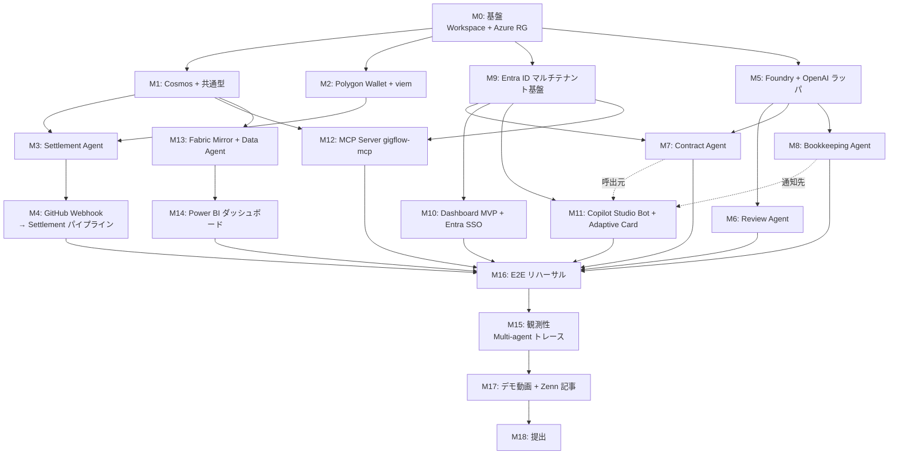

# 03. ビルド順序と受け入れ基準

> **このドキュメントには日付を一切書かない。** 日付固定は妥協を生む。AIエージェントが実装を進めるので、**依存関係**と**受け入れ基準 (AC)**だけが意味を持つ。
>
> 順序は依存関係から自動的に決まる。各マイルストーンの AC をすべて満たしてから次へ進む。AC を満たせない場合は前のマイルストーンに戻る。

---

## マイルストーン依存グラフ

---

## M0: 基盤 (Workspace + Azure Resource Group)

**前提**: なし (これが起点)

**やること**:
- `pnpm-workspace.yaml` で `packages/functions` `packages/dashboard` `packages/mcp-server` `packages/shared` を定義
- 各パッケージに最小の `package.json` + `tsconfig.json`
- `.env.example` のテンプレ
- Azure Resource Group + 基本リソース (Storage, Function App, Key Vault, App Insights, Log Analytics)
- 詳細手順: `docs/04-azure-setup.md` §1〜§6

**AC**:
- `pnpm install` が4パッケージで通る
- Azure Portal で Resource Group / Function App / Key Vault が見える
- `git push` できる状態

---

## M1: Cosmos DB + 共通型定義

**前提**: M0

**やること**:
- `packages/shared/src/types/` に `order.ts` `event.ts` `account.ts` `tenant.ts` を配置 (`docs/01-architecture.md` §4)
- Cosmos DB アカウント + Database `gigflow` + 4 Containers (`orders` / `events` / `accounts` / `tenants`) を作成 (`docs/04-azure-setup.md` §2)
  - すべての partition key 設定が `docs/01-architecture.md` §4.1 と一致していること
- `packages/functions/src/lib/cosmos.ts` — Managed Identity 認証 + tenant-scoped wrapper (`createTenantScopedCosmos`)
- `packages/mcp-server/src/lib/cosmos.ts` — MCP 用の read-only tenant-scoped wrapper
- サンプル order / tenant をシードするスクリプト

**AC**:
- `pnpm --filter functions exec tsx scripts/seed-cosmos.ts` で 1件の order と 1件の tenant が挿入される
- 違う tenantId からはその order が取得**できない** (`createTenantScopedCosmos(otherTenantId).getOrder(id)` が undefined を返すテスト)
- Cosmos のクエリ層を直接呼ぶコード (`cosmos.query('orders', ...)` 等) が `packages/*/src/` 配下に存在しないこと (grep で確認)

---

## M2: Polygon Wallet + viem

**前提**: M0

**やること**:
- 法人ウォレット EOA を生成 (または既存)
- 秘密鍵を Key Vault に格納 (`wallet-pk`)
- Polygon Mainnet に MATIC 投入 (送金ガス用、最低 1 MATIC 程度)
- 法人ウォレットに JPYC を 100,000 程度仕込む
- `packages/functions/src/lib/blockchain.ts` で `transferJpyc(to, amount)` を実装
- `packages/functions/scripts/test-transfer.ts` で疎通

**AC**:
- スクリプトで法人ウォレット → 別ウォレットへ 100 JPYC 送金成功
- Polygonscan で tx 確認できる
- 秘密鍵が一切ログに出ていないことを目視確認

---

## M3: Settlement Agent

**前提**: M1, M2

**やること**:
- `packages/functions/src/agents/settlement.ts` (`docs/02-agents.md` §3)
- Idempotency: `orders.txHash` 空 + `status === 'review_passed'` でのみ実行
- ガードレール: max 100k JPYC / tx, max 10 tx / day, address regex
- ユニットテスト (Vitest): 正常系 + 4 異常系

**AC**:
- ユニットテスト全 pass
- 手動で `review_passed` 状態の order を渡すと JPYC が送金される
- 同じ orderId で 2 回呼んでも 1 回しか送金されない

---

## M4: GitHub Webhook → Settlement パイプライン

**前提**: M3

**やること**:
- `packages/functions/src/functions/githubWebhook.ts`
- HMAC-SHA256 署名検証
- `pull_request.closed && merged` を捕捉
- Issue 本文から `<!-- gigflow:orderId=... -->` 抽出
- delivery_id で重複チェック
- Settlement を非同期起動

**AC**:
- demo repo で手動 order 投入 → Issue 作成 → PR → merge で JPYC が送金される
- merge から txHash 生成までの実測時間が**5秒以内**
- 同じ webhook delivery を 2 回送っても 1 回しか送金されない

---

## M5: Foundry + OpenAI ラッパ

**前提**: M0

**やること**:
- Azure OpenAI リソース + gpt-4o デプロイ (`docs/04-azure-setup.md` §7)
- `packages/functions/src/lib/openai.ts` — Managed Identity 認証
- `runWithTools(systemPrompt, userMessage, tools, toolImpls, maxTurns)` ヘルパ
- Application Insights にトークン使用量を記録

**AC**:
- 「2 + 3 を計算して」で calculator tool が呼ばれ 5 が返る
- App Insights で `tokens_used` カスタムメトリックが見える

---

## M6: Review Agent

**前提**: M5, M4

**やること**:
- `packages/functions/src/lib/github.ts` — Octokit ラッパ
- `packages/functions/src/agents/review.ts` (`docs/02-agents.md` §2)
- PR diff 取得 (50KB cap)
- `submitReview` / `mergePr` tools
- Webhook で `pull_request.opened/synchronize` から起動
- ゴールデン PR サンプル 5 件 + 期待出力 (合格3 / NG2)

**AC**:
- 「単純な合格 PR」で auto-merge → Settlement → JPYC 送金 がフルで動く
- 「明らかな NG」 (CI fail / テスト無し) で reject + コメント
- ゴールデン 5/5 で期待通り

---

## M7: Contract Agent

**前提**: M5, M9 (Entra ID で tenantId を受ける)

> Copilot Studio (M11) は M7 の**呼び出し元**だが、M7 自体は Functions HTTP として独立に動作するので **M11 は前提依存ではない**。M7 と M11 は並列開発可能。

**やること**:
- `packages/functions/src/agents/contract.ts` (`docs/02-agents.md` §1)
- tools: `validateOrderRequest` / `createGithubIssue` / `saveOrder`
- HTTP function `ordersCreate` と `copilotWebhook` の両方から呼ぶ
- Issue 本文に隠しコメント埋込
- Copilot Studio から渡される `conversationReference` を Cosmos `orders.copilotConversationRef` に保存 (M11 完成後の通知用)

**AC**:
- POST `/api/orders/create` で Issue 作成 + Cosmos に保存
- POST `/api/copilot/webhook` でも同じ結果
- 不正入力 (予算オーバー / 期日過去 / 不明な worker) でエラー

---

## M8: Bookkeeping Agent

**前提**: M5, M3 (Settlement の後ろに繋がる)

**やること**:
- `packages/functions/src/agents/bookkeeping.ts` (`docs/02-agents.md` §4)
- Settlement 完了から内部呼び出し
- 出力を Cosmos `orders.bookkeepingArtifacts` に保存
- Copilot Studio Bot Framework REST API で proactive Adaptive Card 送信
- Dashboard SSE 通知

**AC**:
- 送金後、自動で `journalEntry` / `withholding` / `paymentStatementMarkdown` が生成される
- Teams にカードが届く (実際の Bot 配信を待つ場合は M11 後)
- Dashboard でリアルタイム反映

---

## M9: Entra ID マルチテナント基盤

**前提**: M0

**やること**:
- Entra App Registrations 5種 (詳細は `docs/10-entra-id.md` §2):
  - `app-gigflow-dashboard` (SPA / public client)
  - `app-gigflow-functions` (Web API、scope: `orders.write` / `orders.read`)
  - `app-gigflow-mcp` (Web API、scope: `mcp.read`)
  - `app-gigflow-copilot` (Bot Framework)
  - `app-gigflow-fabric` (Web API、scope: `data.read`、Data Agent 呼出 audience)
- `packages/functions/src/lib/auth.ts` — JWT 検証 + `tenantId` 抽出 + roles claim 確認
- `packages/mcp-server/src/auth/entra.ts` — 同等の検証ロジック
- `packages/shared/src/lib/tenant.ts` — テナントスコープのヘルパ
- App roles: `PM` / `Accountant` / `Executive`

**AC**:
- Functions の HTTP エンドポイントが Bearer トークン無しで 401
- 別テナントのトークンで自テナントの order を取得しようとして 403
- App roles に応じて MCP tool 呼び出しがフィルタされる

---

## M10: Dashboard MVP + Entra SSO

**前提**: M9, M7

**やること**:
- Next.js 15 (App Router) を `packages/dashboard/` で初期化
- `@azure/msal-react` または NextAuth Entra ID で SSO
- 発注フォーム (Copilot Studio が使えない時のバックアップ)
- 注文一覧 + 詳細ページ
- SSE で order ステータスのリアルタイム更新
- Container Apps にデプロイ
- 詳細手順: `docs/04-azure-setup.md` §8

**AC**:
- 公開URL で Entra ID ログイン → 発注 → Issue 作成 → 一覧反映
- 別テナントのユーザーのデータが一切見えない (テナント分離テスト)
- order が Settled になった瞬間 UI が自動更新

---

## M11: Copilot Studio Bot + Adaptive Card

**前提**: M9 (Entra)、M0 (Functions の URL が出てから)

**やること**:
- Copilot Studio で Agent 作成
- Topics:
  - `OrderCreate` — 「@gigflow 〜さんに〜お願い」
  - `OrderStatus` — 「〜の状況は?」
  - `MonthlyReport` — 「先月の業務委託費は?」 (Fabric Data Agent に転送)
- HTTP action で Functions の `/api/copilot/webhook` を叩く (on-behalf-of トークン付き)
- Adaptive Card テンプレ:
  - 発注確認カード
  - 完了通知カード (Bookkeeping Agent から呼ばれる)
- Teams チャンネルに発行
- 詳細手順: `docs/08-copilot-studio.md`

**AC**:
- Teams で「@gigflow Sato さんに XX を依頼」と入力 → 確認カード → 承認 → Issue 作成
- 発注後、PR merge → JPYC 送金 → Teams に完了カード自動配信

---

## M12: MCP Server gigflow-mcp

**前提**: M9, M1

**やること**:
- `packages/mcp-server/` を新規作成 (`@modelcontextprotocol/sdk` 使用)
- Transport: HTTPS + Streamable HTTP (Container Apps 上)
- Tools 実装 (`docs/09-mcp-server.md` 参照):
  - `queryOrders(filter)` 
  - `getJournalEntries(month)`
  - `getWithholdingReport(workerId, year)`
  - `exportPaymentStatement(orderId)`
  - `getMonthlyTotals(month)`
- Resources: `gigflow://orders/{id}`, `gigflow://accounts/{id}`
- Entra ID トークン検証 + `Accountant` role 必須
- Container Apps にデプロイ
- 接続手順: Claude Desktop / VS Code / Copilot Studio

**AC**:
- `npx @modelcontextprotocol/inspector https://...` で全 tool が一覧 + 呼び出せる
- Claude Desktop に接続して「先月の Sato さんへの支払い」と問い合わせて結果が返る
- Accountant role を持たないユーザーで 403

---

## M13: Fabric Mirror + Data Agent

**前提**: M1

**やること**:
- Microsoft Fabric capacity 作成 (Trial で OK)
- Workspace `ws-gigflow` 作成
- Cosmos DB Mirror をセットアップ (`orders` / `events`)
- Data Agent を作成、スキーマ定義 + 自然言語クエリのサンプル
- 詳細手順: `docs/11-fabric.md`

**AC**:
- Fabric の Mirrored Database で Cosmos のデータが見える
- Data Agent に「2026年4月の支払い合計」と問い合わせて返答が来る

---

## M14: Power BI ダッシュボード

**前提**: M13

**やること**:
- Power BI レポート作成
  - 月次業務委託費の推移
  - 受注者ランキング
  - 平均リードタイム (発注 → settled)
  - 累計支払 JPYC
- ワークスペースに発行
- Copilot Studio Adaptive Card に埋め込めるリンクを作る

**AC**:
- 経営者ロールでアクセスして数字が見える
- レポートにフィルタ (期間 / 受注者) を入れて変動が反映

---

## M15: Multi-agent 観測性

**前提**: M4, M6, M7, M8, M11, M12

**やること**:
- すべての Agent / MCP / Copilot Studio webhook で `operation_Id` / `correlation_id (= orderId)` を継承
- Application Insights のクエリ:
  - 1 つの orderId で全 Agent の動きが時系列に並ぶ
  - Multi-agent 平均レイテンシ (Copilot 入口 → Bookkeeping 完了)
- カスタムダッシュボード (Workbook) を作る

**AC**:
- App Insights の Workbook で「最後の order」のフルトレースが見える
- レイテンシメトリクスが取れる (Scene 5 の数値の根拠になる)

---

## M16: E2E リハーサル

**前提**: M15 (or 並行で)

**やること**:
- 完全な E2E シナリオを 3 周通す
  1. Copilot Studio から発注
  2. Worker (副アカウント) が PR
  3. Review Agent が approve + merge
  4. Settlement で JPYC 送金
  5. Bookkeeping → Copilot Studio に完了カード
  6. 経理担当者が Claude Desktop から MCP 経由で問合せ
  7. 経営者が Power BI で月次レポート確認
- 各段の所要時間を計測

**AC**:
- 3周連続で完走
- PR merge → txHash が **3秒以内** (95%percentile)
- 各シーンで「絵」が成立 (動画素材として使える)

---

## M17: デモ動画 + Zenn 記事

**前提**: M16

**やること**:
- 撮影 (`docs/06-demo-script.md` の台本に従う)
- 編集 — Scene 5 (PR merge → 3秒で着金) に最大エネルギー
- YouTube に unlisted で投稿
- Zenn 記事執筆 (`docs/07-zenn-outline.md`)
- アーキテクチャ図 (Mermaid) 埋込
- 動画埋込

**AC**:
- 動画が 4:00 前後で完成 (`docs/06-demo-script.md` の 10 シーン構成、3:50〜4:10 に収める)
- Zenn 記事 7,500 字前後で完成 (`docs/07-zenn-outline.md` の章構成)、自分で通読 OK

---

## M18: 提出

**前提**: M17

**やること**:
- 公開URL の動作確認
- 審査員用の Entra ゲストアカウント発行 + 招待方法を Zenn に記載
- すべての Azure リソースが稼働中
- GitHub repo を public 化
- 提出タグ (`git tag v0.9-submission && git push --tags`)
- 応募フォーム提出
- 審査期間 (6/2-6/18) はインフラを止めない

**AC**:
- 23:59 までに提出
- 審査員が Teams + 公開 URL でフルフローを再現できる

---

## バッファとリスク

### 主要リスクと対策

| リスク | 影響 | 対策 |
|---|---|---|
| Azure OpenAI モデルデプロイ承認待ち | M5 が遅延 | 申請を最優先で出す。並行で M0/M1/M2/M9 を進める |
| Polygon RPC 不安定 | Settlement の demo が安定しない | Alchemy / QuickNode の有料プランに切替 |
| OpenAI のJSON出力の不安定 | Review Agent が不規則 | Zod でバリデーション、再試行 1 回 |
| Copilot Studio HTTP action タイムアウト (30秒) | Contract Agent 長引きで失敗 | acknowledge → 非同期通知パターンに切替 |
| Fabric Mirror のレイテンシ | リアルタイム性に欠ける | 経営者向け集計だけに限定。経理問合せは MCP → Cosmos 直読 |
| MCP サーバの認証実装が複雑 | M12 が膨らむ | Entra ID の Easy Auth (Container Apps) を最大活用 |
| Entra マルチテナント設定の罠 | M9 が重い | 最初は single-tenant + multi-org 招待で代替し、後でマルチテナント化 |

### スコープ削減順序 (やむを得ない場合)

1. **絶対に削らない**: Foundry / Copilot Studio / Cosmos / Settlement / Review / Webhook / MCP Server
2. 削れる順:
   1. Power BI ダッシュボードの装飾 (M14 の見栄え部分)
   2. Fabric Data Agent の自然言語精度 (M13 の最後の磨き)
   3. Entra ID のロール分離の細かい部分 (M9 の最後)
   4. Bookkeeping Agent の源泉徴収精度 (税理士確認 promptで逃げる)

スポンサープロダクト (Foundry / Copilot Studio / MCP / Entra / Fabric / Cosmos / GitHub) を**削る選択肢は無い**。これが「全部入りで勝つ」設計の意図。
