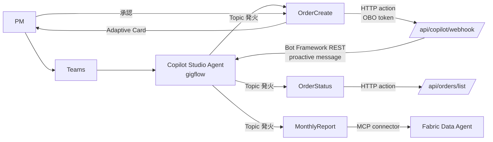

# 08. Copilot Studio Bot

PM の発注 UI の**主経路**。Microsoft Teams 上の Bot として配信し、Adaptive Card で発注確認 / Bookkeeping 完了通知を行う。

## 1. 全体構成



## 2. Bot 作成手順

### 2.1 Copilot Studio で Agent を作成

1. https://copilotstudio.microsoft.com/ にアクセス
2. **新規 Agent** → **空白から作成**
3. 名前: `gigflow`
4. 説明: 「業務委託の発注・状態確認・経理問合せを自動化するエージェント」
5. インストラクション (System Prompt 相当):
   ```
   あなたは「gigflow」エージェント。中小企業の PM が業務委託発注を依頼してきたら、
   発注内容を構造化し、Adaptive Card で確認を取り、承認されたら gigflow Functions API
   に発注を送信する。発注状況や経理レポートの問合せにも応える。
   税務判断や送金可否の最終判断は必ずユーザーに確認する。
   ```

### 2.2 認証設定

1. **設定 → セキュリティ → 認証**
2. 認証方式: **手動 (Manual)**
3. **Microsoft Entra ID v2** を選択
4. App Registration `app-gigflow-copilot` の以下を設定:
   - Client ID
   - Client secret (Key Vault に保管した値)
   - Authorization URL: `https://login.microsoftonline.com/{tenantId}/oauth2/v2.0/authorize`
   - Token URL: `https://login.microsoftonline.com/{tenantId}/oauth2/v2.0/token`
   - Scopes: `api://{functions-app-id}/orders.write api://{mcp-app-id}/mcp.read api://{fabric-app-id}/data.read offline_access`
5. **トークン交換 URL** は空 (delegated 認証で OBO 経由のため)

### 2.3 Teams にデプロイ

1. **チャネル → Teams** を有効化
2. App ID / マニフェストを生成
3. Teams 管理センターで承認 (テナント管理者権限が必要)
4. Teams クライアントから検索してインストール

---

## 3. Topics 設計

### 3.1 OrderCreate

**Trigger phrases**:
- 「@gigflow 発注」
- 「@gigflow さんに依頼」
- 「@gigflow お願い」
- 自由入力 (LLM がインテント判定)

**Variables (Slot filling)**:
- `workerName` (string, required)
- `workDescription` (string, required)
- `amountJpyc` (number, required)
- `deadline` (string, required, datetime parser)
- `repository` (string, optional, デフォルト値あり)

**Steps**:

1. **Message** (Markdown):
   ```
   発注内容を確認させてください。
   ```

2. **Adaptive Card (発注確認)**:
   ```json
   {
     "type": "AdaptiveCard",
     "$schema": "http://adaptivecards.io/schemas/adaptive-card.json",
     "version": "1.5",
     "body": [
       {
         "type": "TextBlock",
         "text": "発注内容の確認",
         "weight": "Bolder",
         "size": "Large"
       },
       {
         "type": "FactSet",
         "facts": [
           { "title": "受注者", "value": "${workerName}" },
           { "title": "業務内容", "value": "${workDescription}" },
           { "title": "報酬", "value": "${amountJpyc} JPYC" },
           { "title": "期日", "value": "${deadline}" },
           { "title": "リポジトリ", "value": "${repository}" }
         ]
       },
       {
         "type": "TextBlock",
         "text": "この内容で発注すると、Contract Agent が GitHub Issue を作成し、PR がマージされた瞬間に JPYC が自動送金されます。",
         "wrap": true,
         "size": "Small",
         "color": "Accent"
       }
     ],
     "actions": [
       {
         "type": "Action.Submit",
         "title": "✅ 承認",
         "data": { "action": "approve" },
         "style": "positive"
       },
       {
         "type": "Action.Submit",
         "title": "✏ 編集",
         "data": { "action": "edit" }
       },
       {
         "type": "Action.Submit",
         "title": "❌ キャンセル",
         "data": { "action": "cancel" },
         "style": "destructive"
       }
     ]
   }
   ```

3. **Condition**: `action == 'approve'`

4. **HTTP request action** (承認時のみ実行):
   - URL: `https://func-gigflow-{suffix}.azurewebsites.net/api/copilot/webhook`
   - Method: `POST`
   - Headers:
     - `Authorization: Bearer ${userToken}` (Topic context の OAuth トークン)
     - `Content-Type: application/json`
   - Body:
     ```json
     {
       "rawDescription": "${workerName} さんに「${workDescription}」を依頼。報酬 ${amountJpyc} JPYC、期日 ${deadline}、リポジトリ ${repository}。",
       "today": "${utcNow()}",
       "conversationReference": "${conversationReference}"
     }
     ```
   - Output: `responseBody` (JSON)

5. **Adaptive Card (発注完了)**:
   ```json
   {
     "type": "AdaptiveCard",
     "version": "1.5",
     "body": [
       {
         "type": "Container",
         "style": "good",
         "items": [
           {
             "type": "TextBlock",
             "text": "✅ 発注完了",
             "weight": "Bolder",
             "size": "Large"
           },
           {
             "type": "TextBlock",
             "text": "GitHub Issue #${responseBody.issueNumber} を作成しました。",
             "wrap": true
           },
           {
             "type": "TextBlock",
             "text": "Contract Agent が処理を完了しました。",
             "size": "Small",
             "isSubtle": true
           }
         ]
       }
     ],
     "actions": [
       {
         "type": "Action.OpenUrl",
         "title": "📋 Issue を開く",
         "url": "${responseBody.issueUrl}"
       },
       {
         "type": "Action.OpenUrl",
         "title": "📊 Dashboard",
         "url": "${env.DASHBOARD_URL}/orders/${responseBody.orderId}"
       }
     ]
   }
   ```

### 3.2 OrderStatus

**Trigger phrases**:
- 「@gigflow 状況」
- 「@gigflow 進捗」
- 「○○の状態は?」

**Steps**:
1. HTTP request action: `GET /api/orders/list?filter=...`
2. Adaptive Card で一覧表示
3. 詳細リンク (Dashboard へ)

### 3.3 MonthlyReport

**Trigger phrases**:
- 「@gigflow 月次レポート」
- 「先月の業務委託費は」
- 「Q1 の累計」

**Steps**:
1. **MCP connector** または **HTTP action** で Fabric Data Agent に問合せ
2. 自然言語応答 + Power BI 埋込リンクを Adaptive Card で返す

---

## 4. Bookkeeping Agent からの proactive message

Bookkeeping Agent が支払い完了通知を Adaptive Card で送るため、Bot Framework の REST API に POST する。

### 4.1 conversationReference の保存

OrderCreate の HTTP action で Functions に渡した `conversationReference` を Cosmos の order ドキュメントに保存:

```ts
// packages/functions/src/agents/contract.ts (の一部)
await cosmos.upsertOrder({
  ...order,
  copilotConversationRef: input.conversationReference,
});
```

### 4.2 proactive 送信

```ts
// packages/functions/src/lib/copilot.ts
import { CloudAdapter, ConfigurationServiceClientCredentialFactory, createBotFrameworkAuthenticationFromConfiguration } from 'botbuilder';

export async function sendBookkeepingCard(
  conversationRef: ConversationReference,
  order: Order,
  artifacts: BookkeepingArtifacts,
): Promise<void> {
  const adapter = createCloudAdapter();
  await adapter.continueConversationAsync(
    process.env.MICROSOFT_APP_ID!,
    conversationRef,
    async (ctx) => {
      const card = buildBookkeepingCompletionCard(order, artifacts);
      await ctx.sendActivity({ attachments: [CardFactory.adaptiveCard(card)] });
    },
  );
}
```

### 4.3 完了通知 Adaptive Card テンプレ

```json
{
  "type": "AdaptiveCard",
  "version": "1.5",
  "body": [
    {
      "type": "Container",
      "style": "good",
      "items": [
        {
          "type": "TextBlock",
          "text": "✅ ${order.workerDisplayName} 様への ${order.amountJpyc} JPYC のお支払いが完了しました。",
          "weight": "Bolder",
          "size": "Medium",
          "wrap": true
        }
      ]
    },
    {
      "type": "FactSet",
      "facts": [
        { "title": "💰 仕訳", "value": "借方 ${journal.debit.account} ${journal.debit.amount} / 貸方 ${journal.credit.account} ${journal.credit.amount}" },
        { "title": "📝 源泉徴収", "value": "${withholding.applies ? withholding.rate + '%' : 'なし'}" },
        { "title": "📊 TxHash", "value": "${order.txHash}" }
      ]
    },
    {
      "type": "TextBlock",
      "text": "経理処理は完了しています。",
      "isSubtle": true,
      "wrap": true
    }
  ],
  "actions": [
    {
      "type": "Action.OpenUrl",
      "title": "📄 支払調書",
      "url": "${dashboardUrl}/orders/${order.id}/payment-statement"
    },
    {
      "type": "Action.OpenUrl",
      "title": "🔗 Polygonscan",
      "url": "https://polygonscan.com/tx/${order.txHash}"
    },
    {
      "type": "Action.OpenUrl",
      "title": "📈 Power BI 月次",
      "url": "${powerBiUrl}"
    }
  ]
}
```

---

## 5. ローカル開発・デバッグ

### 5.1 Bot Framework Emulator

Adaptive Card の見た目とアクション動作を Teams にデプロイせず確認できる:

```bash
# Bot Framework Emulator をダウンロード
# https://github.com/microsoft/BotFramework-Emulator/releases

# Functions をローカル起動
pnpm --filter functions dev

# Emulator から ngrok URL を経由して Functions を叩く
ngrok http 7071
```

### 5.2 Copilot Studio での Test pane

Copilot Studio の **Test your agent** パネルで Topic を発火し、Adaptive Card のレンダリングを確認できる。HTTP action は実環境を叩くので注意。

---

## 6. 監視・運用

- Application Insights のカスタムイベント `copilot_topic_started`, `copilot_card_sent` を必ず emit
- Bot Framework の Application Insights 連携を有効化
- 失敗時の Card にもサポートリンク (`mailto:` or Teams 内サポートチャンネル) を含める

---

## 7. ハマりどころ

| 症状 | 原因 | 対処 |
|---|---|---|
| HTTP action が 30 秒でタイムアウト | Contract Agent が遅い | acknowledge → 非同期で proactive 通知に切替 |
| Adaptive Card がプレーンテキスト表示 | Card の version 不一致 | Teams が対応するのは v1.5 まで、v1.6 を使わない |
| OAuth トークンが渡らない | scope 不足 | App Registration の API permissions を再確認 |
| proactive message が届かない | conversationReference が古い | Topic 発火のたびに reference を上書き保存 |
| Trigger phrase が拾われない | LLM 判定の閾値 | "Use this topic" ヒントをインストラクションに追加 |

---

## 8. 提出に向けて

- 審査員には**ゲスト Entra アカウント**を発行し、招待リンクで Teams + Copilot Studio Bot を触れるようにする
- Bot のインストール手順を Zenn 記事に明記
- 動画 Scene 2 で Copilot Studio + Adaptive Card の絵を必ず撮る (ハッカソン要件の中核アピール)
