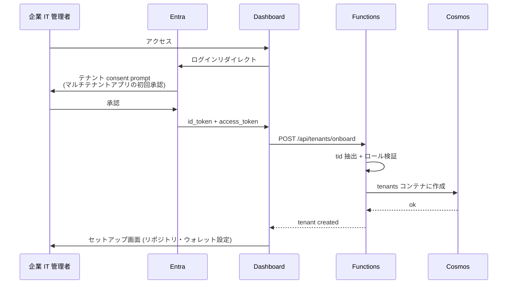
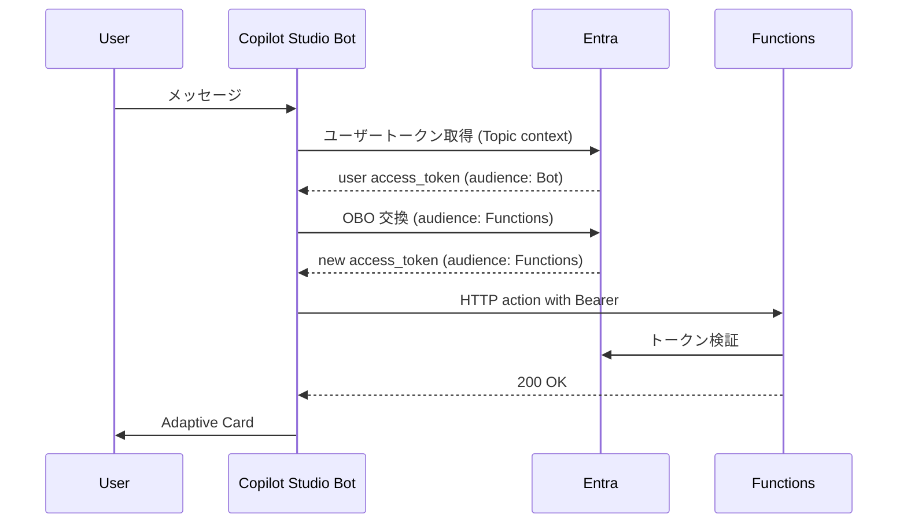

# 10. Microsoft Entra ID マルチテナント設計

すべての入口 (Dashboard / Functions / MCP Server / Copilot Studio) を **Microsoft Entra ID** で統一認証する。`companyId` は Entra `tenantId` をそのまま使い、複数の中小企業がそれぞれの社内アカウントで同じシステムを使えるマルチテナント SaaS を成立させる。

---

## 1. テナント設計の基本方針

| 概念 | 実装 |
|---|---|
| 中小企業 | Entra テナント (1社 = 1テナント) |
| 社員 (PM / 経理 / 経営者) | テナント内ユーザー |
| 受注者 (フリーランス) | **Entra に登録しない**。GitHub login + EVM wallet で識別 |
| アプリ | Multi-tenant App Registration (各テナントが consent して使う) |

> 受注者を Entra に入れない理由: Entra は法人向け ID 管理のため、フリーランスの GitHub アカウント主体の世界観と合わない。受注者の認証は GitHub Webhook の signed payload で済む。

---

## 2. App Registrations 一覧

すべて **Multi-tenant** (`signInAudience: AzureADMultipleOrgs`) で作成。Application ID URI は短縮形式 (`api://gigflow-*`) で統一する。

| Display Name | 種別 | Application ID URI / Scopes |
|---|---|---|
| `app-gigflow-dashboard` | SPA (public client) | redirect: `https://dashboard-...azurecontainerapps.io/api/auth/callback/microsoft-entra-id` |
| `app-gigflow-functions` | Web API | `api://gigflow-functions` / scopes: `orders.write`, `orders.read` |
| `app-gigflow-mcp` | Web API | `api://gigflow-mcp` / scopes: `mcp.read` |
| `app-gigflow-copilot` | Bot | Bot Framework 用、Bot Channel Registration と紐付け |
| `app-gigflow-fabric` | Web API | `api://gigflow-fabric` / scopes: `data.read` |

### 2.1 App roles 定義

`app-gigflow-functions` と `app-gigflow-mcp` の **Manifest > appRoles** に以下を定義:

```json
[
  {
    "id": "11111111-1111-1111-1111-111111111111",
    "allowedMemberTypes": ["User", "Application"],
    "displayName": "PM",
    "value": "PM",
    "description": "Order creation and status",
    "isEnabled": true
  },
  {
    "id": "22222222-2222-2222-2222-222222222222",
    "allowedMemberTypes": ["User", "Application"],
    "displayName": "Accountant",
    "value": "Accountant",
    "description": "Read access to orders, journals, withholding reports",
    "isEnabled": true
  },
  {
    "id": "33333333-3333-3333-3333-333333333333",
    "allowedMemberTypes": ["User", "Application"],
    "displayName": "Executive",
    "value": "Executive",
    "description": "Read access to aggregated reports",
    "isEnabled": true
  }
]
```

各テナントの管理者がユーザーにロールを割当てる。

### 2.2 Scopes vs App roles の概念分離 (重要)

Entra ID では **2 種類の権限モデル**があり、混同すると認証が動かない:

| 概念 | トークンの claim | 用途 | 例 |
|---|---|---|---|
| **Delegated scope** | `scp` | ユーザーが**何の API を**呼べるか | `orders.write`, `mcp.read`, `data.read` |
| **App role** | `roles` | ユーザーが**どの役割で**振る舞うか | `PM`, `Accountant`, `Executive` |

**実装上の使い分け**:

- **scope (`scp`)** は API permission として **「Expose an API」→ Scopes** で定義し、クライアント側 (Dashboard / Copilot Studio) の **API permissions** で要求する。Bearer トークンを発行する際の **audience 制御**に使う。
- **role (`roles`)** は **App roles** で定義し、Entra 管理者が **Enterprise applications → Users and groups** からユーザーに割り当てる。サーバ側で**認可判定**に使う。

**例 (MCP Server の認可)**:
```ts
// 1. scope 検証 (audience が正しい API か)
const { payload } = await jwtVerify(token, JWKS, {
  audience: 'api://gigflow-mcp',
});
if (!(payload.scp ?? '').split(' ').includes('mcp.read')) throw 'invalid scope';

// 2. role 検証 (ユーザーが Accountant or Executive か)
const roles = (payload.roles ?? []) as string[];
if (!roles.includes('Accountant') && !roles.includes('Executive')) throw 'forbidden';
```

### 2.3 API permissions マトリクス (scope ベース)

呼び出し元 → 呼び出し先 (Delegated scope を要求):

| From → To | Required scope | Type |
|---|---|---|
| Dashboard → Functions | `orders.write`, `orders.read` | Delegated |
| Dashboard → MCP | `mcp.read` | Delegated |
| Copilot Studio → Functions | `orders.write` | Delegated (OBO) |
| Copilot Studio → MCP | `mcp.read` | Delegated (OBO) |
| Copilot Studio → Fabric | `data.read` | Delegated (OBO) |
| Bookkeeping (Functions) → Copilot Studio | (Bot Framework token) | Application |

### 2.4 役割マトリクス (role ベース)

App role を必要とする操作:

| 操作 | 必要 role |
|---|---|
| 発注 (POST /api/orders/create) | `PM` |
| 自テナントの注文一覧表示 (Dashboard) | `PM`, `Accountant`, `Executive` のいずれか |
| MCP tools (queryOrders, getJournalEntries 等) | `Accountant` or `Executive` |
| Power BI / Fabric Data Agent | `Executive` (or `Accountant`) |

scope と role は**独立に検証**する (scope OK でも role が無ければ 403)。

---

## 3. テナント onboarding フロー

新規企業が gigflow を導入するときの流れ:



### 3.1 onboarding 後の設定

- 企業の **デフォルト GitHub repo**
- **法人ウォレットアドレス** (送金元、Settlement Agent が使う)
- **支出上限** (per order / monthly)
- 各メンバーへのロール割当 (Entra Portal で実施)
- Fabric ワークスペースの紐付け (経営者向け Power BI 用)

---

## 4. 認証ライブラリ

### 4.1 Dashboard (Next.js)

- **`@azure/msal-react`** または **NextAuth.js (Entra ID provider)**
- 推奨: NextAuth.js (App Router 統合が楽)

```ts
// packages/dashboard/lib/auth.ts
import NextAuth from 'next-auth';
import EntraID from 'next-auth/providers/microsoft-entra-id';

export const { handlers, auth, signIn, signOut } = NextAuth({
  providers: [
    EntraID({
      clientId: process.env.AUTH_ENTRA_CLIENT_ID!,
      clientSecret: process.env.AUTH_ENTRA_CLIENT_SECRET!,
      issuer: 'https://login.microsoftonline.com/common/v2.0',
      authorization: {
        params: {
          scope: `openid profile email api://${process.env.FUNCTIONS_APP_ID}/orders.write api://${process.env.MCP_APP_ID}/mcp.read offline_access`,
        },
      },
    }),
  ],
  callbacks: {
    async jwt({ token, account, profile }) {
      if (account) {
        token.tenantId = (profile as { tid?: string })?.tid;
        token.accessToken = account.access_token;
        token.roles = (profile as { roles?: string[] })?.roles ?? [];
      }
      return token;
    },
    async session({ session, token }) {
      session.tenantId = token.tenantId as string;
      session.accessToken = token.accessToken as string;
      session.roles = token.roles as string[];
      return session;
    },
  },
});
```

### 4.2 Functions / MCP Server (JWT 検証)

```ts
// packages/functions/src/lib/auth.ts (and MCP server側も同等)
import { jwtVerify, createRemoteJWKSet } from 'jose';

const JWKS_COMMON = createRemoteJWKSet(
  new URL('https://login.microsoftonline.com/common/discovery/v2.0/keys'),
);

export async function verifyEntraToken(
  authHeader: string | undefined,
  expectedAudience: string,
): Promise<EntraContext> {
  if (!authHeader?.startsWith('Bearer ')) {
    throw new Error('missing bearer token');
  }
  const token = authHeader.slice(7);
  const { payload } = await jwtVerify(token, JWKS_COMMON, {
    audience: expectedAudience,
  });

  if (!payload.tid) throw new Error('no tenant id');
  if (!payload.oid) throw new Error('no object id');

  return {
    tenantId: String(payload.tid),
    userId: String(payload.oid),
    roles: (payload.roles ?? []) as string[],
    name: String(payload.name ?? ''),
  };
}
```

### 4.3 Tenant scoping enforcement

すべての DB アクセスは tenant-scoped client 経由に限定。

```ts
// packages/functions/src/lib/cosmos.ts
export function createTenantScopedCosmos(tenantId: string) {
  return {
    async listOrders(filter: OrderFilter) {
      // companyId = tenantId を強制
      return cosmos.query('orders', {
        ...filter,
        companyId: tenantId,
      });
    },
    async upsertOrder(order: Omit<Order, 'companyId'>) {
      return cosmos.upsert('orders', { ...order, companyId: tenantId });
    },
    // ...
  };
}
```

**直接の `cosmos.query('orders', {...})` 呼び出しは禁止**。レビューで弾く。

---

## 5. Copilot Studio との連携 (OBO フロー)

Copilot Studio Topic から Functions / MCP / Fabric を呼ぶときの認証フロー:



Copilot Studio の **Authentication > Manual** 設定で各 audience の scope を `api://{functions-app-id}/orders.write` のように追加。

---

## 6. 審査員向けゲストアクセス

### 6.1 ハッカソン用デモテナント

`gigflow-demo.onmicrosoft.com` のような専用テナントを作成。審査員向けには:

1. ゲストアカウント招待 (Entra B2B): `azuregigflow.demo+judge1@gmail.com` 等
2. 招待リンクを Zenn 記事に記載
3. ゲストには `PM` + `Accountant` + `Executive` の全ロールを付与
4. デモデータ (orders 5件、tenants 1件) を投入

### 6.2 招待スクリプト

```bash
# packages/functions/scripts/invite-judge.sh
az ad user invite \
  --invited-user-email-address "judge@example.com" \
  --invited-user-display-name "Hackathon Judge" \
  --invite-redirect-url "https://dashboard-gigflow-{suffix}.azurecontainerapps.io/" \
  --send-invitation-message true \
  --invited-user-message-info '{"customizedMessageBody": "gigflow ハッカソンデモへのご招待"}'
```

---

## 7. デプロイ手順 (要約)

詳細は `docs/04-azure-setup.md` §11 を参照。

```bash
# Multi-tenant App Registration (例: Functions)
az ad app create \
  --display-name "app-gigflow-functions" \
  --sign-in-audience AzureADMultipleOrgs \
  --identifier-uris "api://gigflow-functions"

az ad app permission grant ...
az ad app permission admin-consent ...
```

---

## 8. ハマりどころ

| 症状 | 原因 | 対処 |
|---|---|---|
| `audience mismatch` | App Registration の `Application ID URI` と検証側の expectedAudience が不一致 | 本リポジトリでは短縮 URI (`api://gigflow-functions`, `api://gigflow-mcp`, `api://gigflow-fabric`) で統一。検証側 (Functions/MCP) の `expectedAudience` も同値にする。GUID 形式 (`api://{client-id}`) でも valid だが docs 全体で揃える |
| `unable to verify the first certificate` | JWKS 取得時の TLS | Node 20 + jose で再現せず、ない |
| 別テナントのユーザーが consent できない | `signInAudience: AzureADMyOrg` のまま | Multi-tenant に変更 |
| 受注者を Entra に入れろと指示される | フリーランスを Entra に登録するのは現実的でない | onboarding 設計時に明示的に「receivers are off-Entra」と説明 |
| Copilot Studio の OBO が動かない | Functions の API permission に Bot の app role が付いていない | Bot の object id に role を assign |
| Application audience が `00000003-0000-0000-c000-000000000000` (Microsoft Graph) | scope を access_token ではなく id_token から見ている | API scope を必ず `api://...` 形式で要求 |

---

## 9. セキュリティ考慮事項

- **テナント境界**: Cosmos クエリ層で `companyId = tenantId` を強制 (静的解析で監視可能)
- **トークンキャッシュ**: Dashboard の SSR で id_token をキャッシュする際は HttpOnly Secure Cookie + 短期間
- **role escalation**: ロール変更は Entra 管理者のみ。アプリ側で「ロールを書き換える」操作は提供しない
- **audit**: すべての MCP tool 呼び出しと Functions HTTP 呼び出しを Cosmos `events` に `actorId` (Entra oid) 付きで記録
- **ゲストの権限**: ハッカソンデモ用ゲストには本番ウォレットを触らせない (testnet ウォレット用意するか、send 上限を 1 JPYC に下げる)
