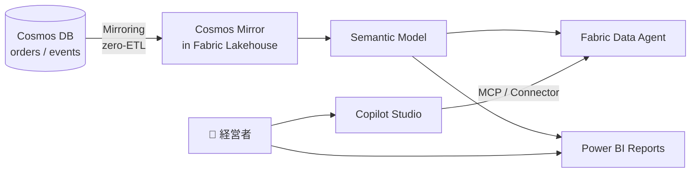

# 11. Microsoft Fabric (Data Agent + Power BI)

経営者向けの自然言語 BI 層。**Cosmos DB を Fabric にミラーリング**し、**Fabric Data Agent** が自然言語問合せに応答、**Power BI** が月次ダッシュボードを提供する。

---

## 1. 構成



### この構成の意味
- **経営者は `Power BI` をブラウザで開いて月次集計を見る**
- **経営者が自然言語で問合せたいとき、Copilot Studio (Teams) に質問 → Fabric Data Agent に転送 → 自然言語応答**
- **経理は MCP Server 経由で詳細クエリ** (リアルタイム性が必要なため Fabric ミラーは経由しない)

---

## 2. リソース作成

### 2.1 Fabric Capacity

ハッカソンでは Trial Capacity (60日) で十分:

1. https://app.fabric.microsoft.com/ にサインイン
2. 設定 → 容量 → **Trial を開始**
3. ワークスペース `ws-gigflow` を作成
4. 容量に紐付け

### 2.2 Cosmos DB Mirroring

Fabric の Mirrored Database 機能で Cosmos を**ゼロ ETL**でミラーリング:

1. ワークスペース → **新規 → Mirrored Azure Cosmos DB**
2. 接続:
   - Cosmos アカウント名: `cosmos-gigflow-{suffix}`
   - 認証: Managed Identity (Fabric の Managed Identity を Cosmos の Reader に追加)
3. ミラー対象コンテナ:
   - `orders` (集計の中心)
   - `events` (監査用)
   - `tenants` (RLS の resolver)
   - **`accounts` はミラーしない** (PII を Fabric に出さない原則)
4. 同期開始

### 2.3 Cosmos の Fabric への RBAC

```bash
# Fabric の Managed Identity Object ID を確認
FABRIC_PRINCIPAL_ID=$(az ...)  # Fabric ワークスペースの principal id

az cosmosdb sql role assignment create \
  --account-name $COSMOS_NAME \
  --resource-group $RG \
  --scope $(az cosmosdb show --name $COSMOS_NAME --resource-group $RG --query id -o tsv) \
  --principal-id $FABRIC_PRINCIPAL_ID \
  --role-definition-id 00000000-0000-0000-0000-000000000001  # Reader
```

---

## 3. Semantic Model 設計

ミラーされた `orders` テーブルの上に Semantic Model を作る:

### 3.1 Tables

`orders` テーブル (Mirror から自動取り込み):

| 列 | 型 | 用途 |
|---|---|---|
| `id` | string | キー |
| `companyId` | string | テナント分離 |
| `workerGithubLogin` | string | 受注者識別 |
| `description` | string | 業務内容 |
| `amountJpyc` | number | 報酬 |
| `status` | string | 状態 |
| `createdAt` | datetime | 発注日時 |
| `txHash` | string | 送金 tx |
| `bookkeepingArtifacts.withholding.applies` | boolean | 源泉徴収有無 |

### 3.2 Measures (DAX)

- **TotalPayments** = `SUM(orders[amountJpyc])`
- **SettledPayments** = `CALCULATE([TotalPayments], orders[status] = "settled" OR orders[status] = "bookkept")`
- **AvgLeadTimeHours** = `AVERAGEX(orders, DATEDIFF(orders[createdAt], orders[settledAt], HOUR))`
- **WithholdingTotal** = `CALCULATE([TotalPayments], orders[bookkeepingArtifacts.withholding.applies] = TRUE)`

### 3.3 Calculated columns

- **YearMonth** = `FORMAT(orders[createdAt], "yyyy-MM")`
- **WorkerDisplay** = `orders[workerGithubLogin]` (accounts は Fabric にミラーしないため GitHub login を直接表示。displayName が必要なら Power BI レポートのスライサーで手動ラベル付けする運用に倒す)

### 3.4 Row-level security (RLS)

テナント分離は `tenants` テーブル (ミラー対象に含まれる) と `USERPRINCIPALNAME()` の domain 比較で行う:

**Step 1**: `tenants` テーブルに `domain` 列を追加 (Cosmos 側に書込時に `tenant.domain = "marche.co.jp"` のように埋める)

**Step 2**: orders テーブルに `tenants` を companyId で join

**Step 3**: RLS ロール `TenantIsolation` の DAX フィルタ:

```dax
orders[companyId] IN
  CALCULATETABLE(
    VALUES(tenants[id]),
    tenants[domain] = SUBSTITUTE(USERPRINCIPALNAME(), LEFT(USERPRINCIPALNAME(), FIND("@", USERPRINCIPALNAME())), "")
  )
```

(USERPRINCIPALNAME の `@` 以降を抜き出して `tenants.domain` と一致するレコードに絞る)

**運用上の注意**: ハッカソンデモではデモテナント1つしか使わないため、RLS 実装は M16 以降に後回しにしても審査員には影響しない。本番運用に向けたエビデンスとして DAX を Zenn 記事に載せる程度で良い。

---

## 4. Fabric Data Agent

### 4.1 Data Agent 作成

1. ワークスペース → **新規 → Data Agent**
2. 名前: `da-gigflow`
3. データソースとして **Semantic Model `sm-gigflow`** を選択
4. **AI スキーマ説明** を設定:
   ```
   The "orders" table contains business outsourcing contracts.
   Each row is a single contract from a Japanese SME (companyId) to a freelance worker (workerGithubLogin).
   Amounts are in JPYC (Japanese Yen Coin), an integer where 1 JPYC = 1 JPY.
   "status" lifecycle: created → in_progress → pr_opened → review_passed → settled → bookkept.
   "settled" means JPYC has been transferred on Polygon.
   "withholding.applies" is whether Japanese withholding tax was deducted.
   ```
5. **Few-shot examples**:
   - Q: "先月の業務委託費の合計は?" → A: 「`SettledPayments` を `YearMonth = LASTMONTH` でフィルタ」
   - Q: "Sato さんへの累計は?" → A: 「`workerGithubLogin = 'sato-taro'` の `TotalPayments`」
   - Q: "源泉徴収あり/なしの内訳" → A: 「`WithholdingTotal` vs `TotalPayments - WithholdingTotal`」

### 4.2 公開エンドポイント

Data Agent には API endpoint が付く。これを Copilot Studio から呼ぶ。

### 4.3 Copilot Studio から呼ぶ

Copilot Studio の **MonthlyReport** Topic から Fabric Data Agent への HTTP request action:

```
POST https://api.fabric.microsoft.com/v1/workspaces/{ws-id}/dataAgents/{agent-id}/query
Authorization: Bearer ${userToken}  # Entra OBO で取得 (audience: api://{fabric-app-id})
Content-Type: application/json

{
  "query": "${userQuestion}",
  "context": {
    "tenantId": "${tenantId}"
  }
}
```

応答を Adaptive Card に整形して返す。

---

## 5. Power BI レポート

### 5.1 経営者向けダッシュボード `pbi-gigflow-monthly`

**ページ 1: サマリ**
- 累計 JPYC 支払 (KPI カード)
- 当月 vs 前月 (棒)
- 月次推移 (折れ線、直近12ヶ月)

**ページ 2: 受注者別**
- ランキングテーブル (上位10名: 累計 / 件数 / 平均)
- マップ (受注者の国別、`countryCode` で集計)

**ページ 3: パイプライン**
- ステータス別件数 (ファネル: created → settled)
- 平均リードタイム (発注 → settled までの時間)
- 異常値検知 (リードタイム > 14日 のもの)

**ページ 4: 経理サポート**
- 月次源泉徴収サマリ
- 仕訳エクスポート (CSV download)
- 「税理士確認推奨」マーカー付き order の一覧

### 5.2 デザイン
- Microsoft の青系 + JPYC ピンクをアクセント
- 全ページに「最終更新: {Mirror sync time}」を表示

### 5.3 公開

- ワークスペース → 発行 → Power BI Service
- **App として配布**: `gigflow-executive-app`
- 各テナントの Executive ロール持ちユーザーに RLS 適用で配布

### 5.4 Copilot Studio Adaptive Card への埋込

Power BI レポートの **secure embed link** を取得し、Card の Action.OpenUrl に設定:

```json
{
  "type": "Action.OpenUrl",
  "title": "📈 Power BI 月次",
  "url": "https://app.powerbi.com/groups/{ws-id}/reports/{report-id}/ReportSection?ctid={tenantId}"
}
```

---

## 6. ローカル開発

Fabric は完全 SaaS のためローカル開発はない。代わりに:

- 開発時は **本物の Fabric ワークスペース (個人テナント)** を使う
- Cosmos の dev データから Mirror が自動同期 (~数分の遅延)
- Power BI Desktop で .pbix を作り発行

---

## 7. デモ用ダミーデータ準備

Scene 7 (経営者ビュー) で「右肩下がり」の月次推移を見せたいので、ダミーデータを Cosmos に投入:

```ts
// packages/functions/scripts/seed-fabric-demo.ts
const months = ['2025-11', '2025-12', '2026-01', '2026-02', '2026-03', '2026-04'];
const baseAmounts = [800000, 750000, 600000, 500000, 380000, 250000];  // 減少傾向

for (const [i, month] of months.entries()) {
  for (let j = 0; j < 8; j++) {
    await seedOrder({
      companyId: DEMO_TENANT_ID,
      amountJpyc: Math.floor(baseAmounts[i] / 8 * (0.8 + Math.random() * 0.4)),
      createdAt: `${month}-15T10:00:00Z`,
      // ...
    });
  }
}
```

これで「**業務委託費が右肩下がり** = 業務改革成功」のメッセージが Power BI で出る。

---

## 8. ハマりどころ

| 症状 | 原因 | 対処 |
|---|---|---|
| Mirror がデータを取り込まない | Cosmos の RBAC 不足 | Reader role を Fabric Managed Identity に付与 |
| Mirror の同期遅延 | 数分〜十分単位 | リアルタイム性が必要なら MCP → Cosmos 直読みを使う |
| Data Agent の自然言語精度が低い | スキーマ説明が薄い | カラム説明 + few-shot を追加 |
| Power BI の RLS が効かない | USERPRINCIPALNAME() の domain 解決失敗 | テナントごとに専用 dataset を分ける運用に切替 |
| Fabric Trial の容量不足 | 大量クエリで bursting | クエリを月単位の集計に絞る |
| Copilot Studio から Data Agent OBO が失敗 | scope 不足 | `api://{fabric-app-id}/data.read` を Bot の API permissions に追加 |

---

## 9. セキュリティ

- **PII を Fabric に出さない** — `accounts` コンテナはミラー対象外。Worker の wallet address や個人名は集計列にしない (GitHub login の表示のみ)
- **Cosmos の Reader RBAC** で書込権限を渡さない
- **RLS** でテナント分離
- **Power BI の Embed link** は短期トークン + テナントスコープ

---

## 10. 費用

- Fabric Trial Capacity: 60日無料
- 提出後は最小の F2 (約 ¥40,000/月) または Trial 延長で運用
- Hackathon 期間 + 審査期間 (6/2-6/18) は Trial で十分

---

## 11. なぜ Fabric Data Agent か (記事用の言い分)

- ハッカソン仕様書 §AI技術 に「Fabric Data Agent / IQ」が明記 → スポンサー要件への直接適合
- 経営者は SQL も DAX も書けない → 自然言語が必須
- **Cosmos の OLTP 用途と Fabric の OLAP / BI 用途を分離** することで、Cosmos の RU 消費を抑えつつ経営層に必要な集計を提供できる
- Power BI と組合せれば「数字を見る」「数字を質問する」両方が同じプラットフォームで完結
