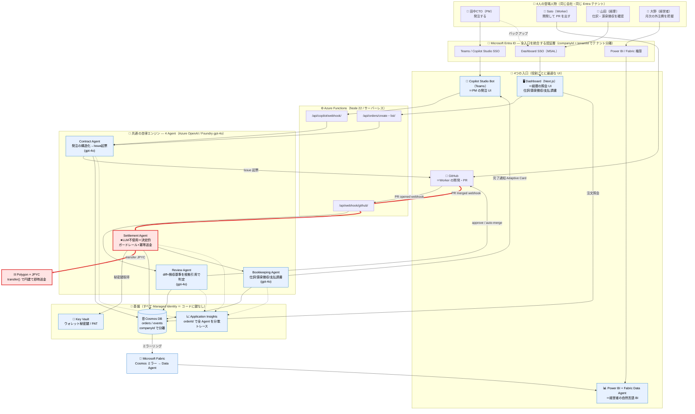
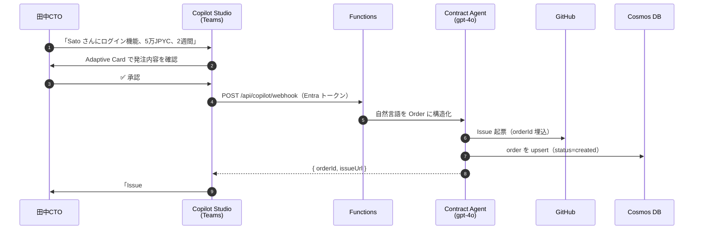
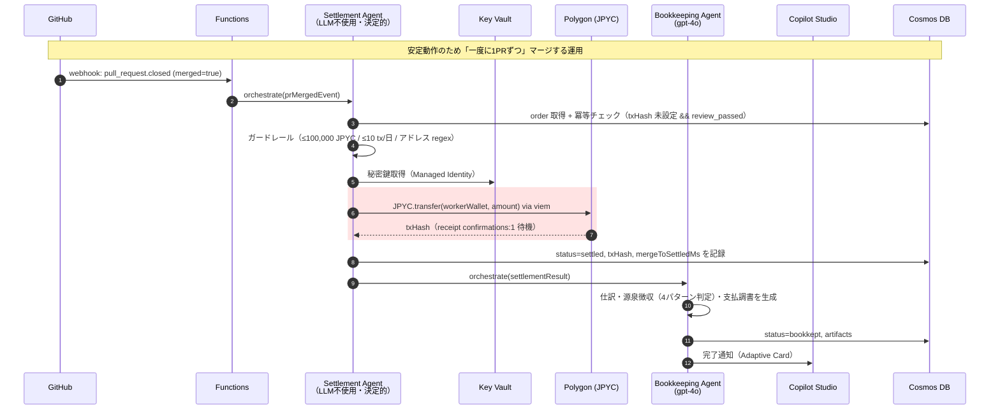
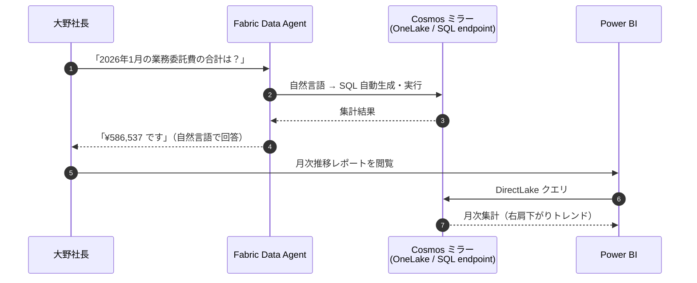
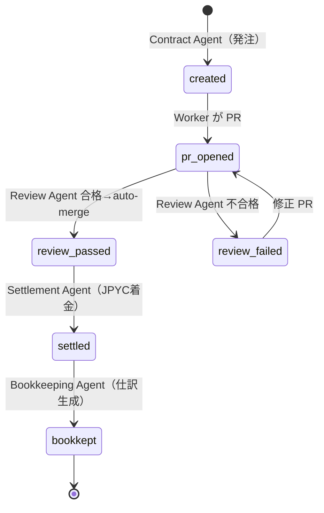

# 提出用アーキテクチャ図（Microsoft 完結版）

> 提出物①。Zenn §3 と動画 Scene 8 に埋め込む。
> 戦略（`docs/SUBMISSION-PLAN-FINAL.md` 判断3）に従い **Microsoft 完結**で描く。
> MCP サーバは実装済みだが提出図では前面に出さない（経理の入口は Dashboard）。
> コンセプト: **「4ユーザー × 4入口 → 共通の自律エンジン（4 Agent）→ JPYC決済 / Cosmos記録」を1枚で。**
> Entra ID が全入口を覆う認証層。山場（PR merge → 3秒で着金）は赤線で強調。

---

## メイン図 — 全体構成



### この図の読み方（審査員向け 3 行）
- **同じ会社の4人が、役割ごとに別々の入口（Teams / GitHub / Dashboard / Power BI）から、同一の自律エンジンに繋がる。** これが Multi-agent エコシステムの最小単位。
- **赤線が山場**: GitHub の PR merge → Settlement Agent → Polygon で **円建て報酬が約3秒で着金**。人手はゼロ。
- **Entra ID が全入口を統合し、すべてのサービス間通信が Managed Identity（鍵レス）。** コードにもログにも秘密鍵が出ない。

---

## 補助シーケンス図1 — 発注（Copilot Studio）



---

## 補助シーケンス図2 — ★山場: PR merge → 3秒で着金 → 記帳



---

## 補助シーケンス図3 — 経営者の自然言語 BI（Fabric Data Agent）



---

## 状態遷移図 — 1 注文のライフサイクル



---

## レンダリング・書き出しメモ

- Zenn はコードフェンスの ` ```mermaid ` をそのまま描画する。**メイン図をそのまま貼れる。**
- 動画 Scene 8 用に PNG/SVG で書き出す場合は Mermaid Live Editor（mermaid.live）に貼って Export、または `@mermaid-js/mermaid-cli`（`mmdc`）を入れて
  `mmdc -i 01-architecture-diagram.md -o arch.png` で一括出力できる（現状ローカルに `mmdc` 未インストール）。
- 赤線（`linkStyle`）はメイン図の山場 3 本に当てている。エッジを足し引きしたら `linkStyle` の番号も合わせて直すこと。
